# Evidence Monorepo Structure Goals

- [Outline](#outline)
  - [Goals](#goals)
  - [Dependency Chart](#dependency-chart)
- [Packages](#packages)
  - [Library Packages](#library-packages)
  - [UI Packages](#ui-packages)
  - [SDK Interface Packages](#sdk-interface-packages)
- [Glossary](#glossary)

## Outline

### Goals:

This document outlines the target structure for the Evidence monorepo.
The target structure has the following goals:

- Clear definition of what functionality should live where
- Good separation of concerns
- Environment and Framework agnosticity
- Ensure modularity to increase flexibility and encourage community contributions
  - Evidence should dogfood all modularity to ensure a good DX for 3rd party developers

### Dependency Chart

```mermaid
---
config:
  theme: dark
---
%%{ init: { 'flowchart': { 'curve': 'monotoneX' } } }%%
graph LR
    %% dependency-free (excluding logging)
    usql("🦆 usql-duckdb")
    echarts("📊 echarts")
    icons("🎨 icons")
    tailwind("🍃 tailwind")

    %% library
    lang-svelte("🧩 lang-svelte")
    sdk("🛠️ sdk")
    vite("📦 vite")

    %% product
    ui-svelte("🖼️ ui-svelte")
    application-shell("📓 application-shell")
    cli("⌨️ cli")
    vscode("🆚 vscode")


  subgraph core["🧠 Core Evidence Functionality"]
    vite
    usql
    sdk
  end

  subgraph svelte-support["🎭 Svelte Language Support"]
    lang-svelte
    ui-svelte
  end

  subgraph ui-utilities["🎨 UI Utilities"]
      tailwind
      icons
      echarts
  end

  subgraph sdk-client["🖥️ SDK User Interfaces"]
    direction TB
    cli
    vscode
  end

  lang-svelte --> sdk
  lang-svelte --> vite

  linkStyle 0,1 stroke:coral,stroke-width:2px;

  application-shell --> ui-svelte
  application-shell --> lang-svelte
  application-shell --> tailwind
  application-shell --> icons
  application-shell --> sdk

  linkStyle 2,3,4,5,6 stroke:yellow,stroke-width:2px;


  ui-svelte --> icons
  ui-svelte --> tailwind
  ui-svelte --> echarts
  ui-svelte --> sdk
  ui-svelte --> vite


  linkStyle 7,8,9,10,11 stroke:red,stroke-width:2px;


  sdk --> usql
  linkStyle 12 stroke:cyan,stroke-width:2px;

  sdk-client --> sdk
  vite --> sdk

note["📝 Packages not shown:
logging, telemetry
(used by most packages)"]

    cli ~~~ vscode
    note ~~~ sdk-client

```

## Packages

This is not a comprehensive list of all packages in the monorepo - it does not include any datasources. These will all exist in `./packages/datasources`, and do not have any bearing on the structure of the project

### Library Packages

#### `@evidence-dev/usql-duckdb`

Provides the only open source driver for Universal SQL, using DuckDB WASM to deliver a fast query layer for NodeJS + Browser environments.

##### Implementation Notes:

- `initDB` and `setParquetURLs` should be collapsed into a single function - right now if you don't set the parquet URLs then the database "fails" to initialize in an unclear way

This functionality was previously provided by `@evidence-dev/universal-sql`

##### Does:

- Provide standard functions for getting query columns and row counts

##### Does Not:

- Interact with DuckDB Native
- Cache to or from the filesystem
- Create `.parquet` files as part of the source evaluation process
- Require being in a Vite project

#### `@evidence-dev/telemetry`

Allows Evidence to collect anonymous information about product usage

##### Does:

- Provide a set, documented list of informations that are collected
- Provide a simple, clear way to opt out of telemetry

##### Does Not:

- Impact performance
- Record any PII or sensitive information

#### `@evidence-dev/vite`

Responsible for providing a Vite plugin for converting a Vite app into an [Evidence App](#evidence-app)

##### Does:

- Source HMR, Query File HMR, etc
- Caching, implicit API at `/_evidence`

##### Does Not:

- Copy files from a [Project](#evidence-project) to an [Application Shell](#application-shell)

#### `@evidence-dev/sdk`

Responsible for encapsulating all Evidence framework logic, contains the needed interfaces to create an [Evidence App](#evidence-app).

##### Does:

- Implement stores using Svelte's store contract (without referencing Svelte directly)
  - Consider using a tool like [nanostores](https://github.com/nanostores/nanostores)
- Provides everything needed to turn a Vite project into an [Evidence App](#evidence-app)
  - This does not include framework-specific ergonomics such as those in [@evidence-dev/lang-svelte](#evidence-devlang-svelte)

##### Does Not:

- Depend on Svelte, React, or any specific framework

##### Exports:

###### `@evidence-dev/sdk/config`

- Utilities for reading and writing `evidence.config.yaml` according to a passed-in Zod Schema

###### `@evidence-dev/sdk/lib`

- Library code used across environments
- `EvidenceError`, `isDebug`, `fillMissingData`, `setTrackProxy`, etc.

###### `@evidence-dev/sdk/lib/datasources`

- Library code to ease the creation of datasource plugins
- Previously `@evidence-dev/db-commons`

###### `@evidence-dev/sdk/plugins/components`

- Utilities for loading [Component Plugins](#component-plugin)

###### `@evidence-dev/sdk/plugins/datasources`

- Utilities for loading [Datasource Plugins](#datasource-plugin)
- Utilities for evaluating [Datasources](#datasources)

###### `@evidence-dev/sdk/plugins/app-shells`

- Exposes functions for setting up the [Application Shell](#application-shell) and copying the [Project](#evidence-project) into it

###### `@evidence-dev/sdk/usql`

- Library code for interacting with USQL
- `Query`, `Metric`, etc.

###### `@evidence-dev/sdk/logger`

- Provide functions for error, warn, log, and debug
- Provide hooks to integrate logs into Evidence UIs (e.g. a log panel in VS Code)
  - These hooks should have a standard interface for the contents of the logs
- Wrap / re-use an existing, tested logging framework to minimize first-party code
  - e.g. `winston` or `pino` should be used under the hood

#### `@evidence-dev/lang-svelte`

Responsible for providing a smooth interface between the [Evidence SDK](#evidence-devsdk) and Svelte.

This functionality was previously provided by `@evidence-dev/component-utilities`, `@evidence-dev/preprocessor` and `@evidence-dev/sdk/utils/svelte`

##### Does:

- Provide a preprocessor to transform Evidence Markdown files to Svelte files
  - Extracts & Bootstraps Queries
  - Injects [Component Plugins](#component-plugin)
  - Initializes [USQL](#evidence-devusql-duckdb)
- Provide an interface to ease the use of [sdk](#evidence-devsdk) functionality in Svelte (e.g. using Svelte's context or lifecycle functions)
  - Includes making SSR in an [Application Shell (plugin)](#application-shell-plugin) or [Evidence App](#evidence-app) trivial

##### Does Not:

- Copy files from an [Evidence Project](#evidence-project) to an [Application Shell](#application-shell)

### UI Packages

#### `@evidence-dev/echarts`

> [!WARNING]
> This package would benefit from more definition and scoping.
> It is not clear where the "boundary" is.  
> For example, will it infer the Y column of a chart if one is not provided?

> [!NOTE]
> Some thought should be given to a similar pattern with mapping logic

Responsible for encapsulating Evidence's echarts configurations in a re-usable package. This package is extracted to enable Evidence charts to be rendered in NodeJS applications.

This functionality was previously provided by `@evidence-dev/core-components` and `@evidence-dev/component-utilities`

##### Does:

- Abstract echarts interactions away from Svelte (e.g. makes [`Chart.svelte`](./packages/ui/core-components/src/lib/unsorted/viz/core/_Chart.svelte))
- Apply echarts theme + styling (incl. user overrides)

##### Does Not:

- Depend on Svelte, React or any other framework
- Validate data (e.g. column existence)
- Summarize data

#### `@evidence-dev/ui-svelte`

Responsible for providing Visualization and UI Components for building
[Evidence Apps](#evidence-app)

This functionality was previously provided by `@evidence-dev/core-components` and `@evidence-dev/component-utilities`

##### Does:

- Provide the components needed to build a quality, comprehensive data application

##### Does Not:

- Provide the building blocks for Application shells

#### `@evidence-dev/icons`

Responsible for supplementing existing icon libraries with Evidence-specific icons

##### Does:

- Provide icon sources using the [steeze-ui](https://github.com/steeze-ui/icons) format
- Support themeing

##### Does Not:

- Depend on Svelte, React or any other framework

#### `@evidence-dev/tailwind`

Responsible for providing a consistent tailwind design language for all things Evidence

##### Does:

- Expose a tailwind preset
- Load and apply [Evidence themes](#evidence-theme)

### SDK Interface Packages

#### `@evidence-dev/cli`

Responsible for managing [Evidence Projects](#evidence-project) and [Datasources](#datasources) with an ergonomic, interactive TUI.

This functionality was previously provided by `@evidence-dev/evidence`

##### Does:

- Provides terminal-based wizards for SDK workflows

#### `create-evidence`

Responsible for enabling `npm create evidence`

##### Does:

- Wrap the [cli](#evidence-devcli)

##### Does Not:

- Implement any functionality

#### `@evidence-dev/vscode`

Responsible for managing [Evidence Projects](#evidence-project) and [Datasources](#datasources) with a VS Code plugin.

This functionality was previously provided by `evidence-vscode`

##### Does:

- Provides wizards for SDK workflows in VS Code

---

## Glossary

### Evidence Terms

#### Evidence

- BI as Code tool using Markdown + SQL to build fast, reactive reports and apps
- Used by the Modern Data Professional
- An [Application Shell](#application-shell) built with the [Evidence Framework](#headless-evidence)

#### Headless Evidence

- Drop-in reactive data layer for any Vite-based application
- Used by front-end developers via [sdk](#evidence-devsdk)

#### Evidence Project

- Uses the [CLI](#evidence-devcli) or [VS Code Extension](#evidence-devvscode) to bootstrap, configure, develop, and deploy.
- Contains known directories (e.g. `pages`, `sources`, etc.), and is copied into an [Application Shell](#application-shell) to create the final site.
- Used to abstract away the complexity of modern web development to make it accessible for data professionals.

#### Evidence App

- The browser based rendering of an [Evidence Project](#evidence-project), either locally in development, or deployed online.

#### Application Shell

- The result of copying the content of an [Evidence Project](#evidence-project) into an [Application Shell Plugin](#application-shell-plugin).
- This will be a "final" project, that can be built into a deployable artifact.
- Application shells are hidden from the user (in the `.evidence` directory)

#### Datasources

- An instance or configuration of a [Datasource Plugin](#datasource-plugin) to create a discrete connection. Multiple datasources can use the same plugin within the same project.

#### Evidence Theme

- A collection of semantic tokens mapped to colors, images, and other customizations. Specified in `evidence.config.yaml`

### Plugins

#### Component Plugin

- A standalone Javascript package that contains components for [Authors](#authors) to use in their apps.
- The components specified in this package are implicitly loaded and do not need to be specified on each page.

#### Datasource Plugin

- A standalone Javascript package that implements one of two interfaces for loading data from somewhere (databases, APIs, flat files, etc) and making it available in Evidence.

#### Application Shell Plugin

- Provides a shell application (in any framework) that creates
  a destination for the files in an [Evidence Project](#evidence-project).
- Includes an initial project state

### Types of Users

#### Developers

- Creates plugins, components, or customizes an application shell (i.e. writing Javascript)

#### Authors

- Creates and maintains [Evidence Projects](#evidence-project) without directly interfacing with the [SDK](#evidence-devsdk)

#### Viewers

- Reads a completed, built [Evidence App](#evidence-app)
