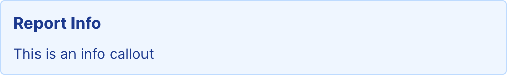

{/* THIS FILE IS AUTOMATICALLY GENERATED - DO NOT MODIFY DIRECTLY */}



````liquid

This is an info callout

````

## Examples

### Basic Usage


````liquid

This is an info callout

````

## Attributes

<ResponseField name="type" type="string" default="info">
  

**Allowed values:**
- `info`
- `success`
- `warning`
- `error`
</ResponseField>

<ResponseField name="title" type="string" default="">
  
</ResponseField>

<ResponseField name="width" type="number">
  Set the width of this component (in percent) relative to the page width
</ResponseField>


