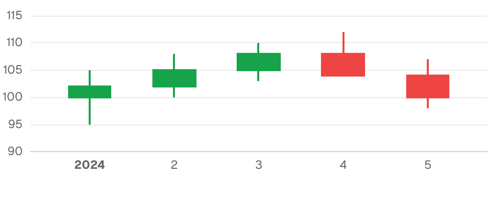
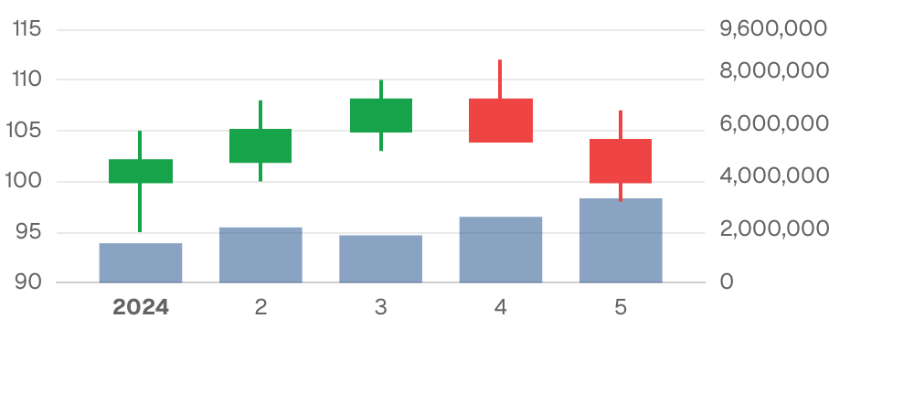
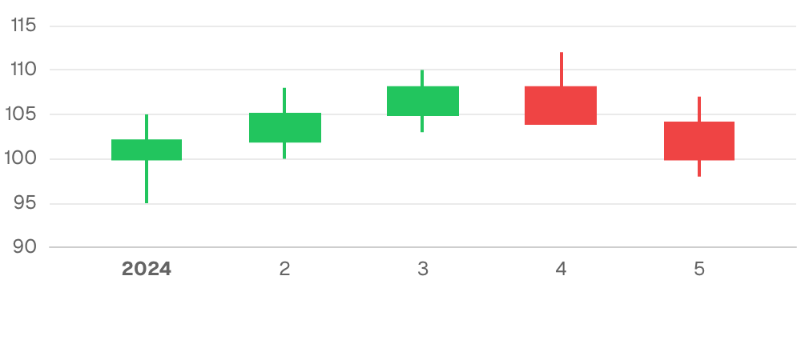

{/* THIS FILE IS AUTOMATICALLY GENERATED - DO NOT MODIFY DIRECTLY */}



````liquid
```sql stock_prices
SELECT '2024-01-01'::date as date, 100.0 as open, 105.0 as high, 95.0 as low, 102.0 as close
UNION ALL SELECT '2024-01-02'::date, 102.0, 108.0, 100.0, 105.0
UNION ALL SELECT '2024-01-03'::date, 105.0, 110.0, 103.0, 108.0
UNION ALL SELECT '2024-01-04'::date, 108.0, 112.0, 106.0, 104.0
UNION ALL SELECT '2024-01-05'::date, 104.0, 107.0, 98.0, 100.0
```


````

## Examples

### Basic Usage


````liquid
```sql stock_prices
SELECT '2024-01-01'::date as date, 100.0 as open, 105.0 as high, 95.0 as low, 102.0 as close
UNION ALL SELECT '2024-01-02'::date, 102.0, 108.0, 100.0, 105.0
UNION ALL SELECT '2024-01-03'::date, 105.0, 110.0, 103.0, 108.0
UNION ALL SELECT '2024-01-04'::date, 108.0, 112.0, 106.0, 104.0
UNION ALL SELECT '2024-01-05'::date, 104.0, 107.0, 98.0, 100.0
```


````

### With Volume



````liquid
```sql stock_prices
SELECT '2024-01-01'::date as date, 100.0 as open, 105.0 as high, 95.0 as low, 102.0 as close, 1500000 as volume
UNION ALL SELECT '2024-01-02'::date, 102.0, 108.0, 100.0, 105.0, 2100000
UNION ALL SELECT '2024-01-03'::date, 105.0, 110.0, 103.0, 108.0, 1800000
UNION ALL SELECT '2024-01-04'::date, 108.0, 112.0, 106.0, 104.0, 2500000
UNION ALL SELECT '2024-01-05'::date, 104.0, 107.0, 98.0, 100.0, 3200000
```


````

### With Custom Colors



````liquid
```sql stock_prices
SELECT '2024-01-01'::date as date, 100.0 as open, 105.0 as high, 95.0 as low, 102.0 as close
UNION ALL SELECT '2024-01-02'::date, 102.0, 108.0, 100.0, 105.0
UNION ALL SELECT '2024-01-03'::date, 105.0, 110.0, 103.0, 108.0
UNION ALL SELECT '2024-01-04'::date, 108.0, 112.0, 106.0, 104.0
UNION ALL SELECT '2024-01-05'::date, 104.0, 107.0, 98.0, 100.0
```


````

## Attributes

<ResponseField name="data" type="string" required>
  Name of the table or view to query
</ResponseField>

<ResponseField name="filters" type="array">
  IDs of filters to apply to the query
</ResponseField>

<ResponseField name="date_range" type="options group">
  Filter data to a time period. `date_range` is an OBJECT with `range` (the period) and optionally `date` (which column to filter on when the table has more than one). Shape: `date_range={ range="last 12 months" date="order_date" }`. `range` accepts predefined values (`last 7 days`, `month to date`), dynamic patterns (`Last 90 days`), custom windows (`2020-01-01 to 2023-03-01`), or partial ranges (`from 2020-01-01`, `until 2023-03-01`). Pass a plain string for `range` — the whole object is NOT a string.

**Example:**
```
date_range={
  range = "today"
  date = "string"
}
```

**Attributes:**
- range: `string` - Time period to filter. Use presets like 'last 7 days', dynamic patterns like 'Last 90 days', custom ranges like '2020-01-01 to 2023-03-01', or partial ranges like 'from 2020-01-01'.
  - **Allowed values:**
    - `today`
    - `yesterday`
    - `last 7 days`
    - `last 30 days`
    - `last 3 months`
    - `last 6 months`
    - `last 12 months`
    - `previous week`
    - `previous month`
    - `previous quarter`
    - `previous year`
    - `this week`
    - `this month`
    - `this quarter`
    - `this year`
    - `next week`
    - `next month`
    - `next quarter`
    - `next year`
    - `week to date`
    - `month to date`
    - `quarter to date`
    - `year to date`
    - `all time`
- date: `string` - Date column to filter on. Required when the data has multiple date columns.

</ResponseField>

<ResponseField name="date_grain" type="string">
  Bucket dates into a grain. Pass the raw date column as `x` and the chart truncates and groups for you. Temporal grains (`day`, `week`, `month`, `quarter`, `year`, `hour`) preserve the year — use for time-series. Seasonality grains (`day of week`, `day of month`, `day of year`, `week of year`, `month of year`, `quarter of year`) collapse across years — use for cyclical patterns like "which month sells most regardless of year".

**Allowed values:**
- `day`
- `week`
- `month`
- `quarter`
- `year`
- `hour`
- `day of week`
- `day of month`
- `day of year`
- `week of year`
- `month of year`
- `quarter of year`
</ResponseField>

<ResponseField name="x" type="string" required>
  Column for x-axis (typically date/time)
</ResponseField>

<ResponseField name="open" type="string" required>
  Column for opening price
</ResponseField>

<ResponseField name="high" type="string" required>
  Column for high price
</ResponseField>

<ResponseField name="low" type="string" required>
  Column for low price
</ResponseField>

<ResponseField name="close" type="string" required>
  Column for closing price
</ResponseField>

<ResponseField name="volume" type="string">
  Column for trading volume (displayed as bars on secondary y-axis)
</ResponseField>

<ResponseField name="x_fmt" type="string">
  Format for x-axis values and labels. See [Value Formatting](/core-concepts/value-formatting) for available formats.
</ResponseField>

<ResponseField name="y_fmt" type="string">
  Format for y-axis values and labels. See [Value Formatting](/core-concepts/value-formatting) for available formats.
</ResponseField>

<ResponseField name="y2_fmt" type="string">
  Format for secondary y-axis (volume) values. See [Value Formatting](/core-concepts/value-formatting) for available formats.
</ResponseField>

<ResponseField name="title" type="string">
  Title to display above the component
</ResponseField>

<ResponseField name="subtitle" type="string">
  Subtitle to display below the title
</ResponseField>

<ResponseField name="info" type="string">
  Information tooltip text (can only be used with title). Displays an info icon next to the title.
</ResponseField>

<ResponseField name="info_link" type="string">
  URL to link the info text to (can only be used with info)
</ResponseField>

<ResponseField name="info_link_title" type="string">
  Create a custom link title for the info link, placed after the info text (can only be used with info_link)
</ResponseField>

<ResponseField name="y_axis_options" type="options group">
  Configure the y-axis

**Example:**
```
y_axis_options={
  title = "string"
  title_position = "top"
  ticks = true
  baseline = true
  labels = true
  gridlines = true
  min = 0
  max = 0
  fit_to_data = true
  interval = 0
}
```

**Attributes:**
- title: `string`
- title_position: `string` - Position of the axis title. "top" places it horizontally at the top, "side" places it vertically along the axis. Defaults to "side" for 100% stacked charts, "top" otherwise.
  - **Allowed values:**
    - `top`
    - `side`
- ticks: `boolean`
- baseline: `boolean`
- labels: `boolean` - Show/hide axis labels
- gridlines: `boolean` - Show/hide gridlines
- min: `number` - Minimum value for this axis (number for numeric axes, date string for date axes)
- max: `number` - Maximum value for this axis (number for numeric axes, date string for date axes)
- fit_to_data: `boolean` - Fit the axis to the data instead of including 0
- interval: `number` - Interval between axis ticks for numeric axes. This option is a suggestion, the actual interval may differ.

</ResponseField>

<ResponseField name="x_axis_options" type="options group">
  Configure the x-axis

**Example:**
```
x_axis_options={
  title = "string"
  show_title = true
  label_wrap = true
  ticks = true
  baseline = true
  labels = true
  gridlines = true
  min = 0
  max = 0
  fit_to_data = true
  min_interval = "year"
  max_interval = "year"
  interval = 0
  label_rotate = 0
  title_arrow = true
  max_label_length = 0
}
```

**Attributes:**
- title: `string`
- show_title: `boolean` - When `true`, renders the auto-derived axis title (the x column name) below the chart. Ignored when `title` is set explicitly. Defaults to `false` — auto-derived column-name titles usually read as visual noise and the axis labels speak for themselves.
- label_wrap: `boolean`
- ticks: `boolean`
- baseline: `boolean`
- labels: `boolean` - Show/hide axis labels
- gridlines: `boolean` - Show/hide gridlines
- min: `number` - Minimum value for this axis (number for numeric axes, date string for date axes)
- max: `number` - Maximum value for this axis (number for numeric axes, date string for date axes)
- fit_to_data: `boolean` - Fit the axis to the data instead of including 0. Defaults to true for numeric x-axes, false otherwise.
- min_interval: `string` - Minimum interval between axis ticks for time-based axes. This option is a suggestion, the actual interval may differ.
  - **Allowed values:**
    - `year`
    - `quarter`
    - `month`
    - `week`
    - `day`
    - `hour`
- max_interval: `string` - Maximum interval between axis ticks for time-based axes. This option is a suggestion, the actual interval may differ.
  - **Allowed values:**
    - `year`
    - `quarter`
    - `month`
    - `week`
    - `day`
    - `hour`
- interval: `number` - Interval between axis ticks for numeric axes. This option is a suggestion, the actual interval may differ.
- label_rotate: `number` - Rotation angle of axis label in degrees. Positive values rotate clockwise, negative values rotate counter-clockwise.
- title_arrow: `boolean` - Show/hide the arrow (→) on the axis title
- max_label_length: `number` - Maximum character length for axis labels. Labels exceeding this length will be truncated with an ellipsis. Defaults to 20 characters when labels are rotated.

</ResponseField>

<ResponseField name="chart_options" type="options group">
  Candlestick chart configuration options

**Attributes:**
- up_color: `string` - Color for bullish (up) candles
- down_color: `string` - Color for bearish (down) candles
- zoom: `boolean` - Enables zoom by dragging on the chart area

</ResponseField>

<ResponseField name="refresh_interval" type="number">
  Time in seconds between automatic data refreshes (minimum 30). Overrides the page-level auto-refresh setting for this component.
</ResponseField>

<ResponseField name="where" type="string">
  Custom SQL WHERE condition to apply to the query. For date filters, use date_range instead.
</ResponseField>

<ResponseField name="having" type="string">
  Custom SQL HAVING condition to apply to the query after GROUP BY
</ResponseField>

<ResponseField name="limit" type="number">
  Maximum number of rows to return from the query. Note: When used with tables, limit will disable subtotals to prevent incomplete subtotal rows.
</ResponseField>

<ResponseField name="order" type="string">
  Column name(s) with optional direction (e.g. "column_name", "column_name desc")
</ResponseField>

<ResponseField name="qualify" type="string">
  Custom SQL QUALIFY condition to filter windowed results
</ResponseField>

<ResponseField name="width" type="number">
  Set the width of this component (in percent) relative to the page width
</ResponseField>

<ResponseField name="height" type="number">
  Set a fixed height for the chart in pixels
</ResponseField>

<ResponseField name="connect_group" type="string">
  Link this chart to others sharing the same id, syncing their tooltips, axis-pointer, and zoom
</ResponseField>

<ResponseField name="tooltip_fields" type="array">
  Extra columns to include in the tooltip on hover. Each entry is `{ value, label?, fmt?, color_by_sign?, down_is_good? }`. See the [tooltip fields guide](/components/tooltip-fields) for examples.
</ResponseField>

<ResponseField name="echarts_options" type="map">
  Raw [ECharts options](https://echarts.apache.org/en/option.html) deep-merged over the chart's final configuration. Use for anything the structured props do not expose — `graphic`, `visualMap`, tooltip styling, and so on. Partial overrides win key-by-key without clobbering Studio's computed siblings. For overrides scoped to the data series, use `echarts_series_options`.

**Example:**
```
echarts_options={
    tooltip={ position="top" }
    graphic=[{ type="text" }]
}
```
</ResponseField>


