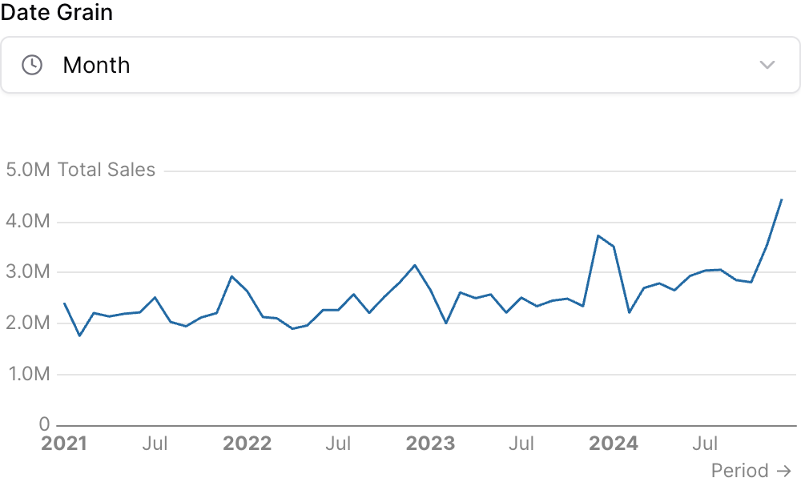

{/* THIS FILE IS AUTOMATICALLY GENERATED - DO NOT MODIFY DIRECTLY */}


````liquid



````

## Examples

### Using `date_grain`


````liquid



````

### Using Inline SQL



````liquid


```sql sales_by_period
select 
    date_trunc({{time_grain}}, date) as period,
    sum(total_sales) as total_sales
from demo.daily_orders
group by 1
order by 1
```


````

## Attributes

<ResponseField name="id" type="string" required>
  The id of the date grain selector to be used in SQL query templates
</ResponseField>

<ResponseField name="preset_values" type="array">
  Optional array of preset date grain values to show. If not provided, all date grain options will be available.
</ResponseField>

<ResponseField name="default_value" type="string">
  Default date grain to select on load

**Allowed values:**
- `day`
- `week`
- `month`
- `quarter`
- `year`
- `hour`
- `day of week`
- `day of month`
- `day of year`
- `week of year`
- `month of year`
- `quarter of year`
</ResponseField>

<ResponseField name="title" type="string" default="Date Grain">
  Text displayed above the selector
</ResponseField>

<ResponseField name="info" type="string">
  Information tooltip text
</ResponseField>

<ResponseField name="info_link" type="string">
  URL to link the info text to (can only be used with info)
</ResponseField>

<ResponseField name="info_link_title" type="string">
  Create a custom link title for the info link, placed after the info text (can only be used with info_link)
</ResponseField>

<ResponseField name="placeholder" type="string">
  Placeholder text displayed when no value is selected
</ResponseField>

<ResponseField name="icon" type="string" default="clock">
  Icon to display
</ResponseField>

<ResponseField name="width" type="number">
  Set the width of this component (in percent) relative to the page width
</ResponseField>

## Using the Filter Variable

Reference this filter using `{{filter_id}}`. The value returned depends on where you use it.

| Context | Default Property | No Selection | Result |
|---------|-----------------|--------------|--------|
| Inline SQL query | `.selected` | `''` | `'month'` |
| `where` attribute | `.selected` | `''` | `'month'` |
| Text / Markdown | `.literal` |  | `month` |

### Available Properties

You can also access specific properties using `{{filter_id.property}}`:

#### .selected
Returns the selected date grain value with quotes. Returns an empty string when no value is selected.

````liquid


```sql sales_by_grain
select 
  toStartOf{{grain.selected}}(date) as period,
  sum(sales) as total_sales
from orders
group by period
```
````

**Example value:** `'month'`

#### .literal
Returns the raw unescaped selected value. Use this with the `date_grain` attribute.

````liquid


```sql sales_by_grain
select 
  {{grain.literal}} as period,
  sum(sales) as total_sales
from orders
group by period
```
````

**Example value:** `month`


