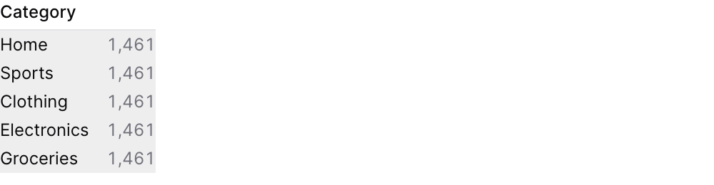
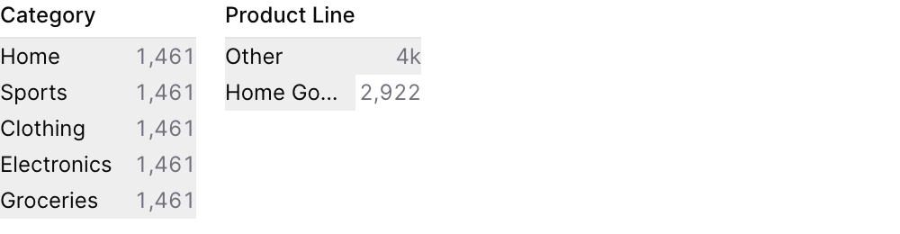

{/* THIS FILE IS AUTOMATICALLY GENERATED - DO NOT MODIFY DIRECTLY */}



````liquid

````

## Examples

### Basic Usage


````liquid

````

### With Explicit Dimensions and Metric

````liquid

````

### Using Filter in Query



````liquid


```sql filtered_orders
select * from orders
where {{order_filter.filter}}
```
````

## Attributes

<ResponseField name="id" type="string" required>
  The id of the dimension grid to use in a `filters` prop
</ResponseField>

<ResponseField name="data" type="string" required>
  Name of the table to query
</ResponseField>

<ResponseField name="dimensions" type="array">
  Array of column names to display as dimensions. If not provided, auto-detects string columns.
</ResponseField>

<ResponseField name="metric" type="string" default="count(*)">
  SQL aggregation expression (default: count(*))
</ResponseField>

<ResponseField name="metric_label" type="string">
  Label displayed above the metric values
</ResponseField>

<ResponseField name="fmt" type="string">
  Format code for the metric values (e.g., "num0", "usd", "pct1"). See [Value Formatting](/core-concepts/value-formatting) for available formats.
</ResponseField>

<ResponseField name="limit" type="number" default="10">
  Maximum number of values to show per dimension (default: 10)
</ResponseField>

<ResponseField name="multiple" type="boolean" default="true">
  Allow multiple selections per dimension (default: true)
</ResponseField>

<ResponseField name="filters" type="array">
  Array of filter IDs to apply when querying dimension values
</ResponseField>

<ResponseField name="where" type="string">
  SQL WHERE clause to filter data
</ResponseField>

<ResponseField name="title" type="string">
  Title displayed above the dimension grid
</ResponseField>

<ResponseField name="subtitle" type="string">
  Subtitle displayed below the title
</ResponseField>

<ResponseField name="date_range" type="options group">
  Filter data to a time period. `date_range` is an OBJECT with `range` (the period) and optionally `date` (which column to filter on when the table has more than one). Shape: `date_range={ range="last 12 months" date="order_date" }`. `range` accepts predefined values (`last 7 days`, `month to date`), dynamic patterns (`Last 90 days`), custom windows (`2020-01-01 to 2023-03-01`), or partial ranges (`from 2020-01-01`, `until 2023-03-01`). Pass a plain string for `range` — the whole object is NOT a string.

**Example:**
```
date_range={
  range = "today"
  date = "string"
}
```

**Attributes:**
- range: `string` - Time period to filter. Use presets like 'last 7 days', dynamic patterns like 'Last 90 days', custom ranges like '2020-01-01 to 2023-03-01', or partial ranges like 'from 2020-01-01'.
  - **Allowed values:**
    - `today`
    - `yesterday`
    - `last 7 days`
    - `last 30 days`
    - `last 3 months`
    - `last 6 months`
    - `last 12 months`
    - `previous week`
    - `previous month`
    - `previous quarter`
    - `previous year`
    - `this week`
    - `this month`
    - `this quarter`
    - `this year`
    - `next week`
    - `next month`
    - `next quarter`
    - `next year`
    - `week to date`
    - `month to date`
    - `quarter to date`
    - `year to date`
    - `all time`
- date: `string` - Date column to filter on. Required when the data has multiple date columns.

</ResponseField>

<ResponseField name="width" type="number">
  Set the width of this component (in percent) relative to the page width
</ResponseField>

## Using the Filter Variable

Reference this filter using `{{filter_id}}`. The value returned depends on where you use it.

| Context | Default Property | No Selection | Result |
|---------|-----------------|--------------|--------|

### Available Properties

You can also access specific properties using `{{filter_id.property}}`:

#### .filter
Returns a complete SQL filter expression combining all dimension selections. Returns `true` when no values are selected.

````liquid


```sql filtered_orders
select * from orders
where {{dim_filter.filter}}
```
````

#### .selected
Returns an object with dimension names as keys and selected values as arrays. Useful for accessing individual dimension selections.

````liquid


Selected categories: {{dim_filter.category}}
Selected regions: {{dim_filter.region}}
````

#### .literal
Returns a human-readable summary of all selections.

````liquid


Active filters: {{dim_filter.literal}}
````


