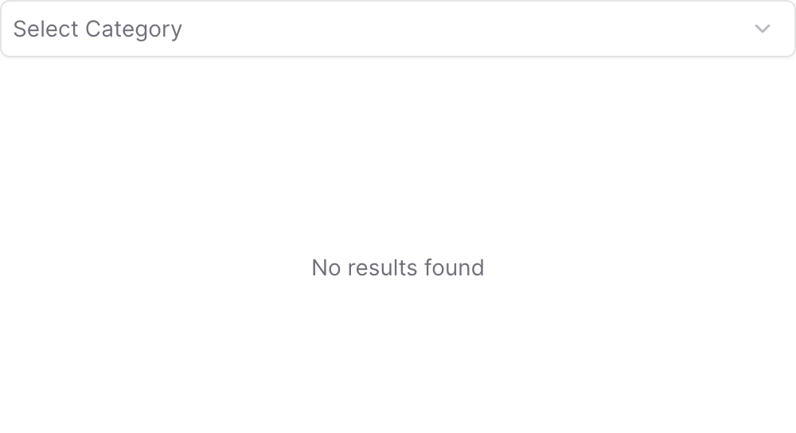
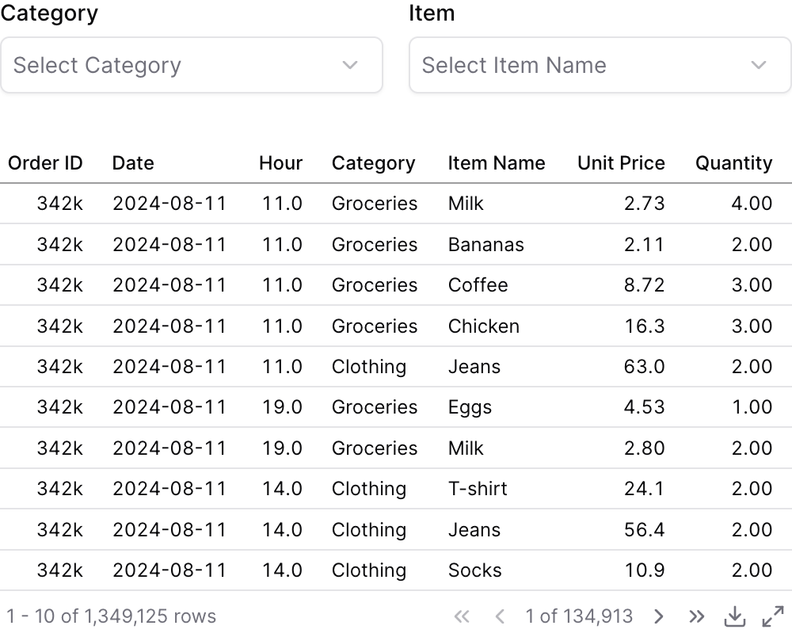

{/* THIS FILE IS AUTOMATICALLY GENERATED - DO NOT MODIFY DIRECTLY */}


````liquid



````

## Examples

### Using `filters`


````liquid



````

### Using `where`


````liquid



````

### Using Inline SQL



````liquid


```sql filtered_orders
select * from demo.daily_orders
where category = {{category_filter}}
```


````

### Using `date_range`


````liquid

````

### Cascading Dropdowns (Linked Filters)



````liquid





````

## Attributes

<ResponseField name="id" type="string" required>
  The id of the dropdown to be used in a `filters` prop
</ResponseField>

<ResponseField name="data" type="string">
  Name of the table to query
</ResponseField>

<ResponseField name="filters" type="array">
  Array of filter IDs to apply when querying for dropdown options. Use this to create cascading/linked dropdowns where selecting a value in one dropdown narrows the available options in this dropdown.
</ResponseField>

<ResponseField name="value_column" type="string">
  Column name to use as the value for each option, and the column to filter by when this dropdown's `id` is used in the `filters` prop of a chart
</ResponseField>

<ResponseField name="label_column" type="string">
  Column name to use as the label for each option
</ResponseField>

<ResponseField name="options" type="array">
  List of options to display in the dropdown
</ResponseField>

<ResponseField name="title" type="string">
  Text displayed above the dropdown
</ResponseField>

<ResponseField name="info" type="string">
  Information tooltip text
</ResponseField>

<ResponseField name="info_link" type="string">
  URL to link the info text to (can only be used with info)
</ResponseField>

<ResponseField name="info_link_title" type="string">
  Create a custom link title for the info link, placed after the info text (can only be used with info_link)
</ResponseField>

<ResponseField name="icon" type="string">
  Icon to display in the dropdown trigger

**Allowed values:**
- `trending-up`
- `trending-down`
- `clock`
- `calendar`
- `check`
- `x`
- `info`
- `alert-circle`
- `help-circle`
- `eye`
- `eye-off`
- `user`
- `users`
- `settings`
- `cog`
- `plus`
- `minus`
- `up`
- `down`
- `right`
- `left`
- `star`
- `heart`
- `search`
- `file`
- `file-text`
- `home`
- `mail`
- `filter`
- `share`
- `bell`
- `trash`
- `credit-card`
- `globe`
- `key`
- `croissant`
- `map`
- `rotate`
- `rewind`
- `bank`
- `receipt`
- `activity`
- `chart-column`
- `chart-pie`
- `chart-no-axes-combined`
- `goal`
- `rocket`
- `trophy`
- `apple`
- `cookie`
- `donut`
- `beef`
- `cake`
- `soup`
- `utensils`
- `milk`
- `nut`
- `pyramid`
- `triangle`
- `arrow-down`
- `arrow-left`
- `arrow-right`
- `arrow-up`
- `chevron-down`
- `chevron-left`
- `chevron-right`
- `chevron-up`
- `chevrons-down`
- `chevrons-left`
- `chevrons-right`
- `chevrons-up`
- `menu`
- `external-link`
- `check-circle`
- `x-circle`
- `edit`
- `trash-2`
- `copy`
- `save`
- `download`
- `upload`
- `send`
- `refresh`
- `redo`
- `undo`
- `folder`
- `folder-open`
- `image`
- `file-image`
- `user-plus`
- `user-minus`
- `user-check`
- `lock`
- `unlock`
- `log-in`
- `log-out`
- `message-square`
- `message-circle`
- `phone`
- `phone-call`
- `bell-off`
- `video`
- `video-off`
- `play`
- `pause`
- `stop`
- `skip-back`
- `skip-forward`
- `volume`
- `volume-1`
- `volume-2`
- `volume-off`
- `volume-x`
- `bookmark`
- `tag`
- `link`
- `unlink`
- `share-2`
- `alert-triangle`
- `loader`
- `more-vertical`
- `more-horizontal`
- `grid`
- `list`
- `maximize`
- `minimize`
- `zoom-in`
- `zoom-out`
- `thumbs-up`
- `thumbs-down`
- `shopping-cart`
- `dollar-sign`
- `camera`
- `printer`
- `monitor`
- `smartphone`
- `laptop`
- `calculator`
- `cloud-sun-rain`
- `sun-snow`
- `thermometer-sun`
- `thermometer-snowflake`
- `cloudy`
- `cloud-rain-wind`
- `cloud-rain`
- `wind`
- `sun`
- `cloud-snow`
- `thermometer`
- `cloud-drizzle`
- `cloud-sun`
- `cloud`
- `cloud-lightning`
- `snowflake`
- `flame`
- `atom`
- `fuel`
- `magnet`
- `factory`
- `tree-deciduous`
- `waypoints`
- `plug`
- `dam`
- `battery`
</ResponseField>

<ResponseField name="initial_value" type="string | number | array">
  Initial selected value(s)
</ResponseField>

<ResponseField name="select_first" type="boolean" default="false">
  Automatically select the first option when the component loads
</ResponseField>

<ResponseField name="default_top_n" type="number">
  For a multi-select dropdown, pre-selects the first N options (after `order` is applied) when the component loads. Generalizes `select_first`. Does not limit the option list and has no effect when `multiple=false`.
</ResponseField>

<ResponseField name="placeholder" type="string">
  Placeholder text displayed when no value is selected
</ResponseField>

<ResponseField name="search" type="boolean" default="true">
  Includes a search input within the dropdown menu
</ResponseField>

<ResponseField name="multiple" type="boolean" default="false">
  Allows multiple selections
</ResponseField>

<ResponseField name="clear" type="boolean" default="true">
  Includes a clear button to unselect the selected value(s)
</ResponseField>

<ResponseField name="order" type="string">
  Column name(s) with optional direction (e.g. "column_name", "column_name desc")
</ResponseField>

<ResponseField name="where" type="string">
  Custom SQL WHERE condition to apply to the query. For date filters, use date_range instead.
</ResponseField>

<ResponseField name="date_range" type="options group">
  Filter data to a time period. `date_range` is an OBJECT with `range` (the period) and optionally `date` (which column to filter on when the table has more than one). Shape: `date_range={ range="last 12 months" date="order_date" }`. `range` accepts predefined values (`last 7 days`, `month to date`), dynamic patterns (`Last 90 days`), custom windows (`2020-01-01 to 2023-03-01`), or partial ranges (`from 2020-01-01`, `until 2023-03-01`). Pass a plain string for `range` — the whole object is NOT a string.

**Example:**
```
date_range={
  range = "today"
  date = "string"
}
```

**Attributes:**
- range: `string` - Time period to filter. Use presets like 'last 7 days', dynamic patterns like 'Last 90 days', custom ranges like '2020-01-01 to 2023-03-01', or partial ranges like 'from 2020-01-01'.
  - **Allowed values:**
    - `today`
    - `yesterday`
    - `last 7 days`
    - `last 30 days`
    - `last 3 months`
    - `last 6 months`
    - `last 12 months`
    - `previous week`
    - `previous month`
    - `previous quarter`
    - `previous year`
    - `this week`
    - `this month`
    - `this quarter`
    - `this year`
    - `next week`
    - `next month`
    - `next quarter`
    - `next year`
    - `week to date`
    - `month to date`
    - `quarter to date`
    - `year to date`
    - `all time`
- date: `string` - Date column to filter on. Required when the data has multiple date columns.

</ResponseField>

<ResponseField name="width" type="number">
  Set the width of this component (in percent) relative to the page width
</ResponseField>

## Using the Filter Variable

Reference this filter using `{{filter_id}}`. The value returned depends on where you use it.

The examples below show values for three scenarios:
- **No selection**
- **Single select:** "Electronics" selected
- **Multi select:** "Sports" and "Home" selected (when `multiple=true`)

| Context | Default Property | No Selection | Single Select | Multi Select |
|---------|-----------------|--------------|---------------|-------------|
| Inline SQL query | `.selected` | `''` | `'Electronics'` | `('Sports', 'Home')` |
| `where` attribute | `.selected` | `''` | `'Electronics'` | `('Sports', 'Home')` |
| Text / Markdown | `.literal` |  | `Electronics` | `Sports, Home` |

### Available Properties

You can also access specific properties using `{{filter_id.property}}`:

#### .filter
Returns a complete SQL filter expression ready to use in WHERE clauses. Returns `true` when no value is selected.

````liquid


```sql filtered_products
select * from products
where {{category_filter.filter}}
```
````

| No Selection | Single Select | Multi Select |
|--------------|---------------|-------------|
| `true` | `category = 'Electronics'` | `category IN ('Sports', 'Home')` |

#### .selected
Returns the selected value(s) wrapped in quotes, suitable for SQL comparisons. Returns an empty string when no value is selected.

````liquid


```sql products_by_category
select * from products
where category = {{category_filter.selected}}
```
````

| No Selection | Single Select | Multi Select |
|--------------|---------------|-------------|
| `''` | `'Electronics'` | `('Sports', 'Home')` |

#### .literal
Returns the raw unescaped selected value(s), useful for display in text or dynamic column selection.

````liquid


```sql dynamic_sort
select * from products
order by {{sort_column.literal}}
```
````

| No Selection | Single Select | Multi Select |
|--------------|---------------|-------------|
| `` | `Electronics` | `Sports, Home` |

#### .label
Returns the display label for the selected option(s). Falls back to the value if no label is defined.

````liquid

    
    
    


Selected: {{category_filter.label}}
````

| No Selection | Single Select | Multi Select |
|--------------|---------------|-------------|
| `` | `Electronics` | `Sports, Home` |

#### .fmt
Returns the format string associated with the selected option. For multiple selections, returns the first format.

````liquid

    
    



````

| No Selection | Single Select | Multi Select |
|--------------|---------------|-------------|
| `` | `usd` | `usd` |


## Allowed Children

- [option](/components/option)


