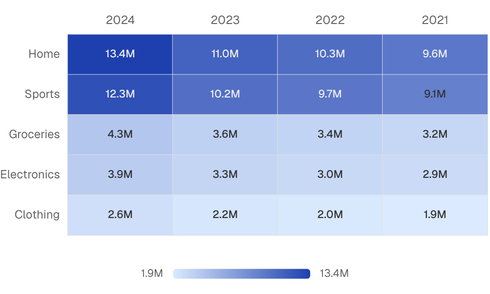
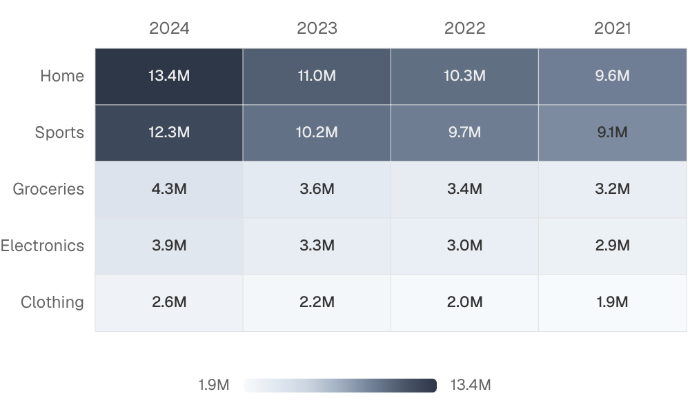

{/* THIS FILE IS AUTOMATICALLY GENERATED - DO NOT MODIFY DIRECTLY */}



````liquid

````

## Examples

### Basic Usage


````liquid

````

### With Custom Colors



````liquid

````

## Attributes

<ResponseField name="data" type="string">
  Name of the table to query. Omit when using `metric`.
</ResponseField>

<ResponseField name="metric" type="string">
  Semantic metric name to display, from metrics/*.yaml. Use instead of the raw data/value/x/y attributes.
</ResponseField>

<ResponseField name="filters" type="array">
  IDs of filters to apply to the query
</ResponseField>

<ResponseField name="date_range" type="options group">
  Filter data to a time period. `date_range` is an OBJECT with `range` (the period) and optionally `date` (which column to filter on when the table has more than one). Shape: `date_range={ range="last 12 months" date="order_date" }`. `range` accepts predefined values (`last 7 days`, `month to date`), dynamic patterns (`Last 90 days`), custom windows (`2020-01-01 to 2023-03-01`), or partial ranges (`from 2020-01-01`, `until 2023-03-01`). Pass a plain string for `range` — the whole object is NOT a string.

**Example:**
```
date_range={
  range = "today"
  date = "string"
}
```

**Attributes:**
- range: `string` - Time period to filter. Use presets like 'last 7 days', dynamic patterns like 'Last 90 days', custom ranges like '2020-01-01 to 2023-03-01', or partial ranges like 'from 2020-01-01'.
  - **Allowed values:**
    - `today`
    - `yesterday`
    - `last 7 days`
    - `last 30 days`
    - `last 3 months`
    - `last 6 months`
    - `last 12 months`
    - `previous week`
    - `previous month`
    - `previous quarter`
    - `previous year`
    - `this week`
    - `this month`
    - `this quarter`
    - `this year`
    - `next week`
    - `next month`
    - `next quarter`
    - `next year`
    - `week to date`
    - `month to date`
    - `quarter to date`
    - `year to date`
    - `all time`
- date: `string` - Date column to filter on. Required when the data has multiple date columns.

</ResponseField>

<ResponseField name="x_date_grain" type="string">
  Bucket dates into a grain. Pass the raw date column as `x` and the chart truncates and groups for you. Temporal grains (`day`, `week`, `month`, `quarter`, `year`, `hour`) preserve the year — use for time-series. Seasonality grains (`day of week`, `day of month`, `day of year`, `week of year`, `month of year`, `quarter of year`) collapse across years — use for cyclical patterns like "which month sells most regardless of year".

**Allowed values:**
- `day`
- `week`
- `month`
- `quarter`
- `year`
- `hour`
- `day of week`
- `day of month`
- `day of year`
- `week of year`
- `month of year`
- `quarter of year`
</ResponseField>

<ResponseField name="y_date_grain" type="string">
  Bucket dates into a grain. Pass the raw date column as `x` and the chart truncates and groups for you. Temporal grains (`day`, `week`, `month`, `quarter`, `year`, `hour`) preserve the year — use for time-series. Seasonality grains (`day of week`, `day of month`, `day of year`, `week of year`, `month of year`, `quarter of year`) collapse across years — use for cyclical patterns like "which month sells most regardless of year".

**Allowed values:**
- `day`
- `week`
- `month`
- `quarter`
- `year`
- `hour`
- `day of week`
- `day of month`
- `day of year`
- `week of year`
- `month of year`
- `quarter of year`
</ResponseField>

<ResponseField name="x" type="string" required>
  Column name for x-axis categories
</ResponseField>

<ResponseField name="y" type="string" required>
  Column name for y-axis categories
</ResponseField>

<ResponseField name="x_axis_title" type="string">
  Title to display for the x-axis
</ResponseField>

<ResponseField name="y_axis_title" type="string">
  Title to display for the y-axis
</ResponseField>

<ResponseField name="value" type="string">
  Column name for cell values. Omit when using `metric`.
</ResponseField>

<ResponseField name="title" type="string">
  Title to display above the chart
</ResponseField>

<ResponseField name="subtitle" type="string">
  Subtitle to display below the title
</ResponseField>

<ResponseField name="info" type="string">
  Info text to display in a tooltip next to the title. Can only be used with the title prop.
</ResponseField>

<ResponseField name="info_link" type="string">
  URL to link the info text to (can only be used with info)
</ResponseField>

<ResponseField name="info_link_title" type="string">
  Create a custom link title for the info link, placed after the info text (can only be used with info_link)
</ResponseField>

<ResponseField name="value_fmt" type="string">
  Format for values (defaults to `num`, or the metric format in metric mode). See [Value Formatting](/core-concepts/value-formatting) for available formats.
</ResponseField>

<ResponseField name="x_fmt" type="string">
  Format for x axis labels. See [Value Formatting](/core-concepts/value-formatting) for available formats.
</ResponseField>

<ResponseField name="y_fmt" type="string">
  Format for y axis labels. See [Value Formatting](/core-concepts/value-formatting) for available formats.
</ResponseField>

<ResponseField name="x_sort" type="string">
  Sort order for x axis categories (asc or desc)

**Allowed values:**
- `asc`
- `desc`
</ResponseField>

<ResponseField name="y_sort" type="string">
  Sort order for y axis categories (asc or desc)

**Allowed values:**
- `asc`
- `desc`
</ResponseField>

<ResponseField name="value_sort" type="string">
  Sort categories by total value (asc or desc). Applies to the first axis without explicit sort.

**Allowed values:**
- `asc`
- `desc`
</ResponseField>

<ResponseField name="legend" type="boolean" default="true">
  Show color scale legend
</ResponseField>

<ResponseField name="borders" type="boolean" default="true">
  Show borders around heatmap cells
</ResponseField>

<ResponseField name="chart_options" type="options group">
  Chart configuration options

**Example:**
```
chart_options={
  color_scale = ["value1", "value2"]
  color_palette = ["value1", "value2"]
}
```

**Attributes:**
- color_scale: `array of strings` - Array of hex colors for the heatmap gradient. A single-color array auto-expands to [background, color].
- color_palette: `array of strings` - Deprecated. Use `color_scale`.

</ResponseField>

<ResponseField name="refresh_interval" type="number">
  Time in seconds between automatic data refreshes (minimum 30). Overrides the page-level auto-refresh setting for this component.
</ResponseField>

<ResponseField name="where" type="string">
  Custom SQL WHERE condition to apply to the query. For date filters, use date_range instead.
</ResponseField>

<ResponseField name="having" type="string">
  Custom SQL HAVING condition to apply to the query after GROUP BY
</ResponseField>

<ResponseField name="limit" type="number">
  Maximum number of rows to return from the query. Note: When used with tables, limit will disable subtotals to prevent incomplete subtotal rows.
</ResponseField>

<ResponseField name="order" type="string">
  Column name(s) with optional direction (e.g. "column_name", "column_name desc")
</ResponseField>

<ResponseField name="qualify" type="string">
  Custom SQL QUALIFY condition to filter windowed results
</ResponseField>

<ResponseField name="width" type="number">
  Set the width of this component (in percent) relative to the page width
</ResponseField>

<ResponseField name="height" type="number">
  Set a fixed height for the chart in pixels
</ResponseField>

<ResponseField name="connect_group" type="string">
  Link this chart to others sharing the same id, syncing their tooltips, axis-pointer, and zoom
</ResponseField>

<ResponseField name="tooltip_fields" type="array">
  Extra columns to include in the tooltip on hover. Each entry is `{ value, label?, fmt?, color_by_sign?, down_is_good? }`. See the [tooltip fields guide](/components/tooltip-fields) for examples.
</ResponseField>

<ResponseField name="echarts_options" type="map">
  Raw [ECharts options](https://echarts.apache.org/en/option.html) deep-merged over the chart's final configuration. Use for anything the structured props do not expose — `graphic`, `visualMap`, tooltip styling, and so on. Partial overrides win key-by-key without clobbering Studio's computed siblings. For overrides scoped to the data series, use `echarts_series_options`.

**Example:**
```
echarts_options={
    tooltip={ position="top" }
    graphic=[{ type="text" }]
}
```
</ResponseField>

<ResponseField name="echarts_series_options" type="map">
  Raw [ECharts series options](https://echarts.apache.org/en/option.html#series) deep-merged into the chart series. Use for series-level styling the structured props do not expose.

**Example:**
```
echarts_series_options={
    itemStyle={ borderRadius=8 }
}
```
</ResponseField>


