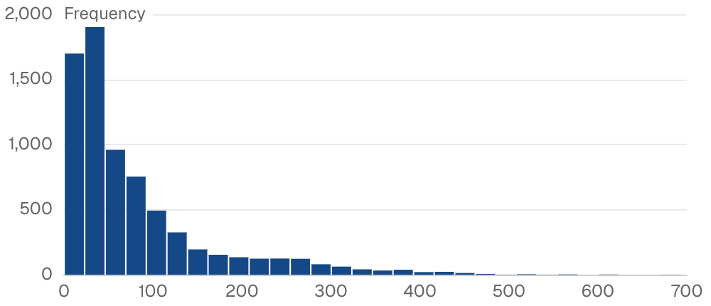

{/* THIS FILE IS AUTOMATICALLY GENERATED - DO NOT MODIFY DIRECTLY */}



````liquid

````

## Examples

### Basic Usage


````liquid

````

## Attributes

<ResponseField name="data" type="string" required>
  Name of the table to query
</ResponseField>

<ResponseField name="value" type="string" required>
  SQL expression for the values to create histogram for
</ResponseField>

<ResponseField name="series" type="string">
  Column name to group data by series
</ResponseField>

<ResponseField name="chart_options" type="options group">
  Chart configuration options

**Example:**
```
chart_options={
  color_palette = ["value1", "value2"]
}
```

**Attributes:**
- color_palette: `array of strings`

</ResponseField>

<ResponseField name="bin_count" type="number" default="20">
  Number of bins for the histogram (takes precedence over bin_width)
</ResponseField>

<ResponseField name="bin_width" type="number">
  Width of each bin (ignored if bin_count is specified)
</ResponseField>

<ResponseField name="fmt" type="string">
  Format for the column values displayed in bin ranges. See [Value Formatting](/core-concepts/value-formatting) for available formats.
</ResponseField>

<ResponseField name="filters" type="array">
  IDs of filters to apply to the query
</ResponseField>

<ResponseField name="title" type="string">
  Title to display above the histogram
</ResponseField>

<ResponseField name="subtitle" type="string">
  Subtitle to display below the title
</ResponseField>

<ResponseField name="info" type="string">
  Info text to display in a tooltip next to the title. Can only be used with the title prop.
</ResponseField>

<ResponseField name="info_link" type="string">
  URL to link the info text to (can only be used with info)
</ResponseField>

<ResponseField name="info_link_title" type="string">
  Create a custom link title for the info link, placed after the info text (can only be used with info_link)
</ResponseField>

<ResponseField name="legend" type="boolean" default="true">
  Show legend
</ResponseField>

<ResponseField name="legend_location" type="string" default="top">
  Position of the legend (top or bottom)

**Allowed values:**
- `top`
- `bottom`
</ResponseField>

<ResponseField name="refresh_interval" type="number">
  Time in seconds between automatic data refreshes (minimum 30). Overrides the page-level auto-refresh setting for this component.
</ResponseField>

<ResponseField name="where" type="string">
  Custom SQL WHERE condition to apply to the query. For date filters, use date_range instead.
</ResponseField>

<ResponseField name="limit" type="number">
  Maximum number of rows to return from the query. Note: When used with tables, limit will disable subtotals to prevent incomplete subtotal rows.
</ResponseField>

<ResponseField name="width" type="number">
  Set the width of this component (in percent) relative to the page width
</ResponseField>

<ResponseField name="height" type="number">
  Set a fixed height for the chart in pixels
</ResponseField>

<ResponseField name="connect_group" type="string">
  Link this chart to others sharing the same id, syncing their tooltips, axis-pointer, and zoom
</ResponseField>

<ResponseField name="echarts_options" type="map">
  Raw [ECharts options](https://echarts.apache.org/en/option.html) deep-merged over the chart's final configuration. Use for anything the structured props do not expose — `graphic`, `visualMap`, tooltip styling, and so on. Partial overrides win key-by-key without clobbering Studio's computed siblings. For overrides scoped to the data series, use `echarts_series_options`.

**Example:**
```
echarts_options={
    tooltip={ position="top" }
    graphic=[{ type="text" }]
}
```
</ResponseField>

<ResponseField name="echarts_series_options" type="map">
  Raw [ECharts series options](https://echarts.apache.org/en/option.html#series) deep-merged into the chart series. Use for series-level styling the structured props do not expose.

**Example:**
```
echarts_series_options={
    itemStyle={ borderRadius=8 }
}
```
</ResponseField>


