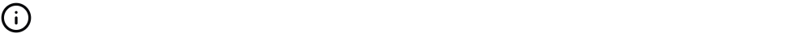

{/* THIS FILE IS AUTOMATICALLY GENERATED - DO NOT MODIFY DIRECTLY */}


````liquid

````

## Examples

### Basic Usage


````liquid

````

### With Size


````liquid

````

### With Color


````liquid

````

### With Tooltip



````liquid

````

## Attributes

<ResponseField name="name" type="string" required>
  Name of the icon to display

**Allowed values:**
- `trending-up`
- `trending-down`
- `clock`
- `calendar`
- `check`
- `x`
- `info`
- `alert-circle`
- `help-circle`
- `eye`
- `eye-off`
- `user`
- `users`
- `settings`
- `cog`
- `plus`
- `minus`
- `up`
- `down`
- `right`
- `left`
- `star`
- `heart`
- `search`
- `file`
- `file-text`
- `home`
- `mail`
- `filter`
- `share`
- `bell`
- `trash`
- `credit-card`
- `globe`
- `key`
- `croissant`
- `map`
- `rotate`
- `rewind`
- `bank`
- `receipt`
- `activity`
- `chart-column`
- `chart-pie`
- `chart-no-axes-combined`
- `goal`
- `rocket`
- `trophy`
- `apple`
- `cookie`
- `donut`
- `beef`
- `cake`
- `soup`
- `utensils`
- `milk`
- `nut`
- `pyramid`
- `triangle`
- `arrow-down`
- `arrow-left`
- `arrow-right`
- `arrow-up`
- `chevron-down`
- `chevron-left`
- `chevron-right`
- `chevron-up`
- `chevrons-down`
- `chevrons-left`
- `chevrons-right`
- `chevrons-up`
- `menu`
- `external-link`
- `check-circle`
- `x-circle`
- `edit`
- `trash-2`
- `copy`
- `save`
- `download`
- `upload`
- `send`
- `refresh`
- `redo`
- `undo`
- `folder`
- `folder-open`
- `image`
- `file-image`
- `user-plus`
- `user-minus`
- `user-check`
- `lock`
- `unlock`
- `log-in`
- `log-out`
- `message-square`
- `message-circle`
- `phone`
- `phone-call`
- `bell-off`
- `video`
- `video-off`
- `play`
- `pause`
- `stop`
- `skip-back`
- `skip-forward`
- `volume`
- `volume-1`
- `volume-2`
- `volume-off`
- `volume-x`
- `bookmark`
- `tag`
- `link`
- `unlink`
- `share-2`
- `alert-triangle`
- `loader`
- `more-vertical`
- `more-horizontal`
- `grid`
- `list`
- `maximize`
- `minimize`
- `zoom-in`
- `zoom-out`
- `thumbs-up`
- `thumbs-down`
- `shopping-cart`
- `dollar-sign`
- `camera`
- `printer`
- `monitor`
- `smartphone`
- `laptop`
- `calculator`
- `cloud-sun-rain`
- `sun-snow`
- `thermometer-sun`
- `thermometer-snowflake`
- `cloudy`
- `cloud-rain-wind`
- `cloud-rain`
- `wind`
- `sun`
- `cloud-snow`
- `thermometer`
- `cloud-drizzle`
- `cloud-sun`
- `cloud`
- `cloud-lightning`
- `snowflake`
- `flame`
- `atom`
- `fuel`
- `magnet`
- `factory`
- `tree-deciduous`
- `waypoints`
- `plug`
- `dam`
- `battery`
</ResponseField>

<ResponseField name="size" type="number" default="20">
  Size of the icon
</ResponseField>

<ResponseField name="color" type="string">
  Color of the icon, use hex codes, rgb/rgba, or a css color name
</ResponseField>

<ResponseField name="tooltip" type="string">
  Tooltip text for the icon
</ResponseField>

<ResponseField name="stroke_width" type="number" default="2">
  Width of the icon outline
</ResponseField>


