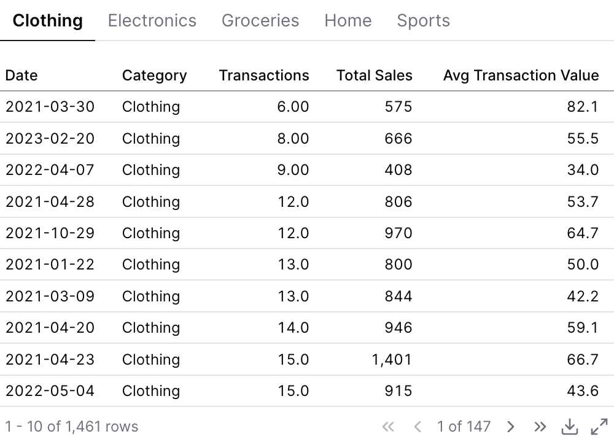

{/* THIS FILE IS AUTOMATICALLY GENERATED - DO NOT MODIFY DIRECTLY */}


````liquid



````

## Examples

### Using `filters`


````liquid



````

### Using `where`


````liquid



````

### Using Inline SQL



````liquid


```sql filtered_orders
select * from demo.daily_orders
where category = {{category_filter}}
```


````

## Attributes

<ResponseField name="id" type="string" required>
  The id of the input tabs to be used in a `filters` prop
</ResponseField>

<ResponseField name="data" type="string">
  Name of the table to query
</ResponseField>

<ResponseField name="filters" type="array">
  Array of filter IDs to apply when querying for options
</ResponseField>

<ResponseField name="value_column" type="string">
  Column name to use as the value for each option, and the column to filter by when this input tabs' `id` is used in the `filters` prop of a chart
</ResponseField>

<ResponseField name="label_column" type="string">
  Column name to use as the label for each option
</ResponseField>

<ResponseField name="initial_value" type="string">
  Initial selected value (single selection only)
</ResponseField>

<ResponseField name="variant" type="string" default="default">
  Visual style variant: "default" for underline style, "well" for button-style tabs

**Allowed values:**
- `default`
- `well`
</ResponseField>

<ResponseField name="full_width" type="boolean" default="false">
  Whether the tabs should take the full width of their container
</ResponseField>

<ResponseField name="align" type="string" default="left">
  Horizontal alignment of tabs. Note: align right only affects the default variant.

**Allowed values:**
- `left`
- `right`
</ResponseField>

<ResponseField name="select_first" type="boolean" default="true">
  Automatically select the first option when the component loads (defaults to true)
</ResponseField>

<ResponseField name="order" type="string">
  Column name(s) with optional direction (e.g. "column_name", "column_name desc")
</ResponseField>

<ResponseField name="where" type="string">
  Custom SQL WHERE condition to apply to the query. For date filters, use date_range instead.
</ResponseField>

<ResponseField name="date_range" type="options group">
  Filter data to a time period. `date_range` is an OBJECT with `range` (the period) and optionally `date` (which column to filter on when the table has more than one). Shape: `date_range={ range="last 12 months" date="order_date" }`. `range` accepts predefined values (`last 7 days`, `month to date`), dynamic patterns (`Last 90 days`), custom windows (`2020-01-01 to 2023-03-01`), or partial ranges (`from 2020-01-01`, `until 2023-03-01`). Pass a plain string for `range` — the whole object is NOT a string.

**Example:**
```
date_range={
  range = "today"
  date = "string"
}
```

**Attributes:**
- range: `string` - Time period to filter. Use presets like 'last 7 days', dynamic patterns like 'Last 90 days', custom ranges like '2020-01-01 to 2023-03-01', or partial ranges like 'from 2020-01-01'.
  - **Allowed values:**
    - `today`
    - `yesterday`
    - `last 7 days`
    - `last 30 days`
    - `last 3 months`
    - `last 6 months`
    - `last 12 months`
    - `previous week`
    - `previous month`
    - `previous quarter`
    - `previous year`
    - `this week`
    - `this month`
    - `this quarter`
    - `this year`
    - `next week`
    - `next month`
    - `next quarter`
    - `next year`
    - `week to date`
    - `month to date`
    - `quarter to date`
    - `year to date`
    - `all time`
- date: `string` - Date column to filter on. Required when the data has multiple date columns.

</ResponseField>

<ResponseField name="width" type="number">
  Set the width of this component (in percent) relative to the page width
</ResponseField>

## Using the Filter Variable

Reference this filter using `{{filter_id}}`. The value returned depends on where you use it.

| Context | Default Property | No Selection | Result |
|---------|-----------------|--------------|--------|
| Inline SQL query | `.selected` | `''` | `'Electronics'` |
| `where` attribute | `.selected` | `''` | `'Electronics'` |
| Text / Markdown | `.literal` |  | `Electronics` |

### Available Properties

You can also access specific properties using `{{filter_id.property}}`:

#### .filter
Returns a complete SQL filter expression ready to use in WHERE clauses. Returns `true` when no value is selected.

````liquid


```sql filtered_products
select * from products
where {{category_filter.filter}}
```
````

**Example value:** `category = 'Electronics'`

#### .selected
Returns the selected value wrapped in quotes, suitable for SQL comparisons. Returns an empty string when no value is selected.

````liquid


```sql products_by_category
select * from products
where category = {{category_filter.selected}}
```
````

**Example value:** `'Electronics'`

#### .literal
Returns the raw unescaped selected value, useful for display in text or dynamic column selection.

````liquid


```sql dynamic_sort
select * from products
order by {{sort_column.literal}}
```
````

**Example value:** `Electronics`

#### .label
Returns the display label for the selected option. Falls back to the value if no label is defined.

````liquid

    
    
    


Selected: {{category_filter.label}}
````

**Example value:** `Electronics`

#### .fmt
Returns the format string associated with the selected option. Useful for dynamically updating chart formatting.

````liquid

    
    



````

**Example value:** `usd`


## Allowed Children

- [option](/components/option)


