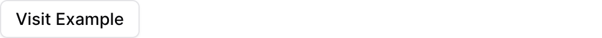

{/* THIS FILE IS AUTOMATICALLY GENERATED - DO NOT MODIFY DIRECTLY */}



````liquid

````

## Examples

### Basic Usage


````liquid

````

## Attributes

<ResponseField name="url" type="string" required>
  The URL to link to
</ResponseField>

<ResponseField name="title" type="string" required>
  Text displayed on the button
</ResponseField>

<ResponseField name="new_tab" type="boolean" default="false">
  Whether to open the link in a new tab
</ResponseField>

<ResponseField name="variant" type="string" default="default">
  Button style variant

**Allowed values:**
- `default`
- `primary`
- `destructive`
- `secondary`
- `ghost`
- `link`
</ResponseField>


