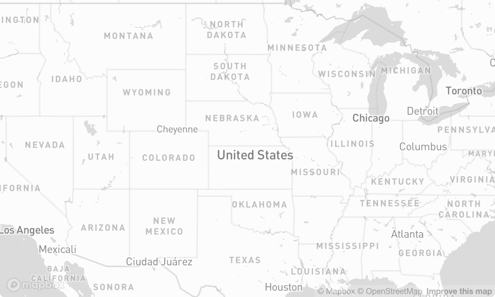
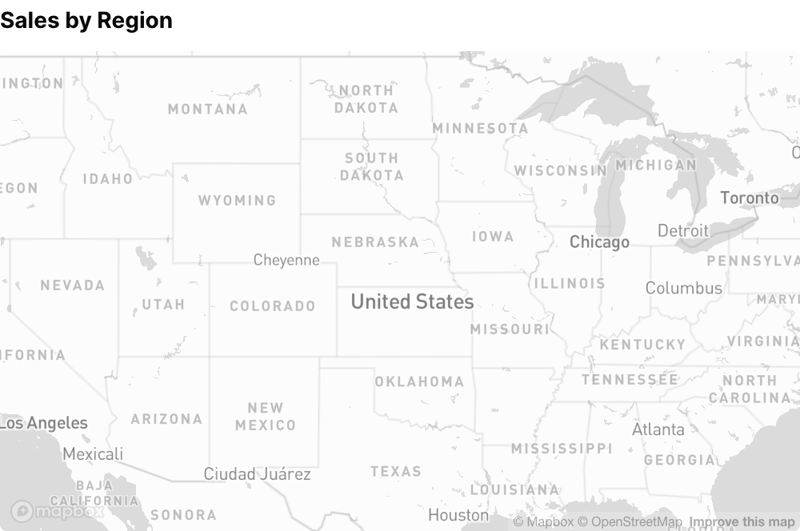
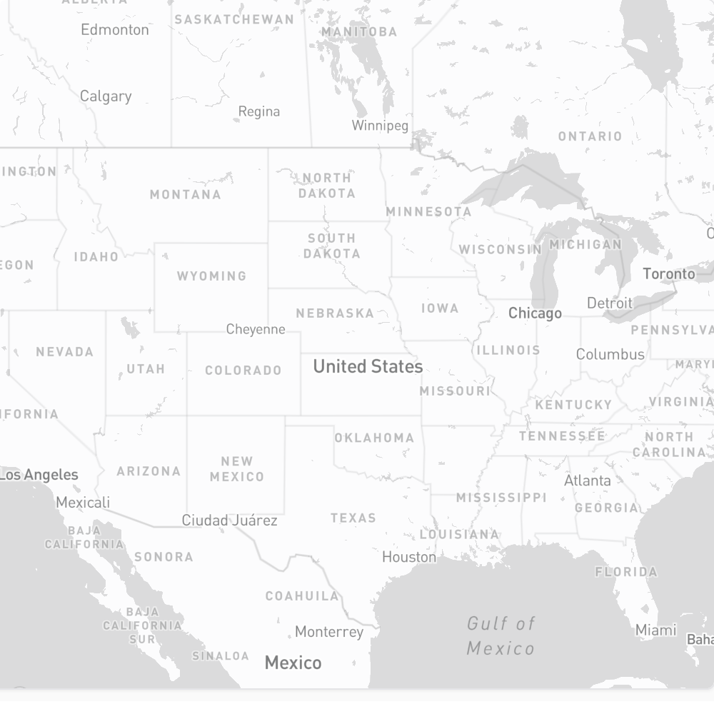
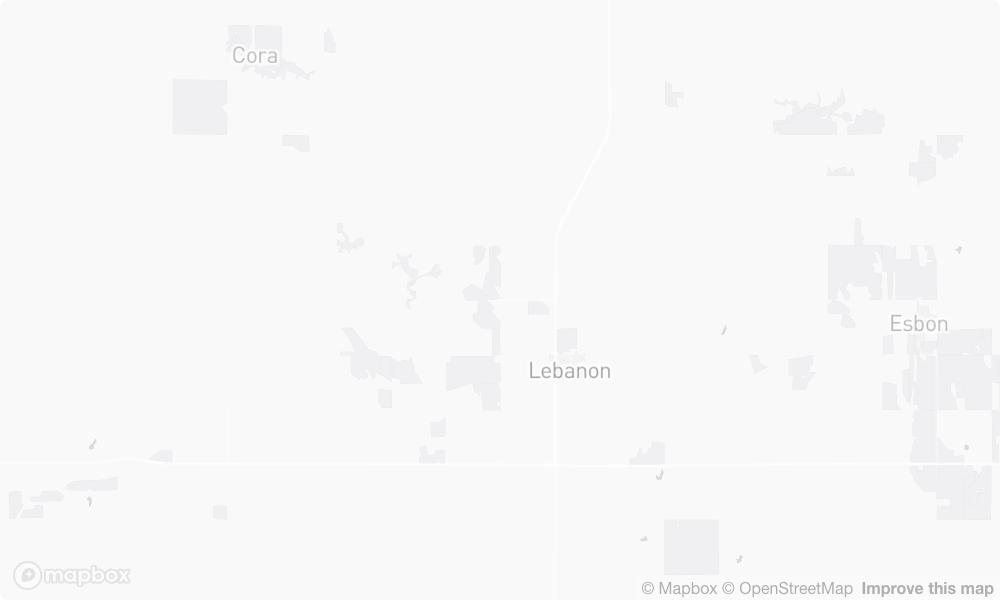
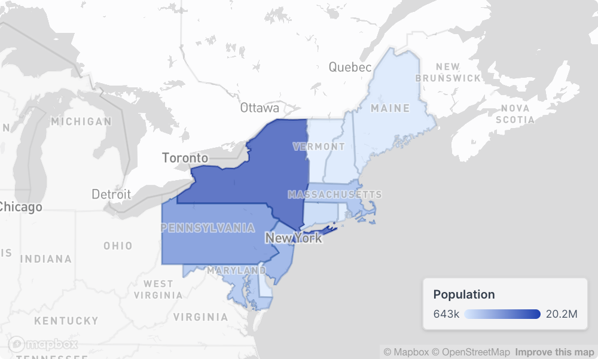
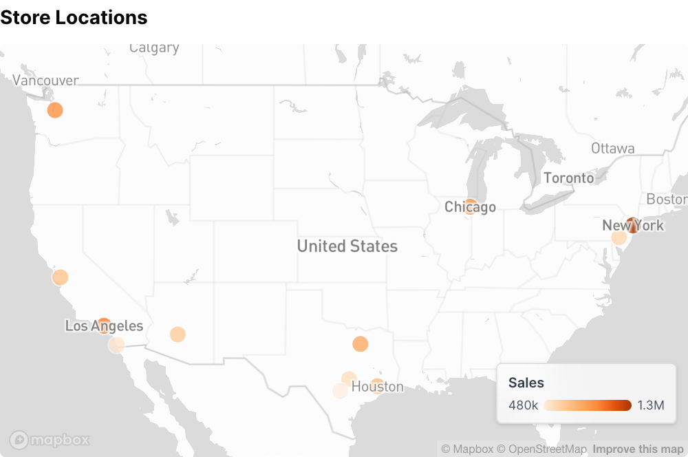

{/* THIS FILE IS AUTOMATICALLY GENERATED - DO NOT MODIFY DIRECTLY */}



````liquid


````

## Examples

### Basic Map


````liquid


````

### Map with Title



````liquid


````

### Custom Height



````liquid


````

### Custom Zoom Level



````liquid


````

### Map with Choropleth Layer



````liquid
```sql east_coast_states
    select 'Maine' as state, 1362359 as population union all 
    select 'New Hampshire', 1377529 union all 
    select 'Vermont', 643077 union all 
    select 'Massachusetts', 7029917 union all 
    select 'Rhode Island', 1097379 union all 
    select 'Connecticut', 3605944 union all 
    select 'New York', 20201249 union all 
    select 'New Jersey', 9288994 union all 
    select 'Pennsylvania', 13002700 union all 
    select 'Delaware', 989948 union all 
    select 'Maryland', 6177224
```


    

````

### Map with Point Layer



````liquid
```sql us_stores
select 40.7128 as lat, -74.0060 as lng, 1250000 as sales union all
select 34.0522, -118.2437, 980000 union all
select 41.8781, -87.6298, 875000 union all
select 29.7604, -95.3698, 720000 union all
select 33.4484, -112.0740, 650000 union all
select 39.9526, -75.1652, 590000 union all
select 29.4241, -98.4936, 480000 union all
select 32.7157, -117.1611, 520000 union all
select 32.7767, -96.7970, 810000 union all
select 37.3382, -121.8863, 690000 union all
select 30.2672, -97.7431, 560000 union all
select 47.6062, -122.3321, 920000
```


    

````

### Map with Heatmap Layer

````liquid

    

````

## Attributes

<ResponseField name="title" type="string">
  Title to display above the map
</ResponseField>

<ResponseField name="subtitle" type="string">
  Subtitle to display below the title
</ResponseField>

<ResponseField name="info" type="string">
  Information tooltip text (can only be used with title)
</ResponseField>

<ResponseField name="info_link" type="string">
  URL to link the info text to (can only be used with info)
</ResponseField>

<ResponseField name="info_link_title" type="string">
  Create a custom link title for the info link, placed after the info text (can only be used with info_link)
</ResponseField>

<ResponseField name="height" type="number" default="300">
  Height of the map in pixels
</ResponseField>

<ResponseField name="initial_position" type="array">
  Initial map center position as [latitude, longitude]. Overrides auto-zoom to data bounds
</ResponseField>

<ResponseField name="zoom" type="number">
  Zoom level (0-22, where higher is more zoomed in). When provided without initial_position, centers on data at this zoom level. When provided with initial_position, uses this zoom at that position
</ResponseField>

<ResponseField name="zoomable" type="boolean" default="true">
  Allow users to zoom in/out on the map
</ResponseField>

<ResponseField name="pannable" type="boolean" default="true">
  Allow users to pan/drag the map
</ResponseField>

<ResponseField name="base_style" type="string" default="mono">
  Base map style: "mono" for theme-aware monochrome basemap, "blank" for solid background only

**Allowed values:**
- `mono`
- `blank`
</ResponseField>

<ResponseField name="projection" type="string" default="flat">
  Map projection: "globe" for 3D globe view, "flat" for 2D flat map

**Allowed values:**
- `globe`
- `flat`
</ResponseField>

<ResponseField name="legend" type="boolean" default="true">
  Show legends for map layers
</ResponseField>

<ResponseField name="legend_location" type="string" default="bottom_right">
  Location of the legend within the map

**Allowed values:**
- `top_left`
- `top_right`
- `bottom_left`
- `bottom_right`
</ResponseField>

<ResponseField name="width" type="number">
  Set the width of this component (in percent) relative to the page width
</ResponseField>

## Allowed Children

- [area_layer](/components/area_layer)
- [point_layer](/components/point_layer)
- [heatmap_layer](/components/heatmap_layer)


