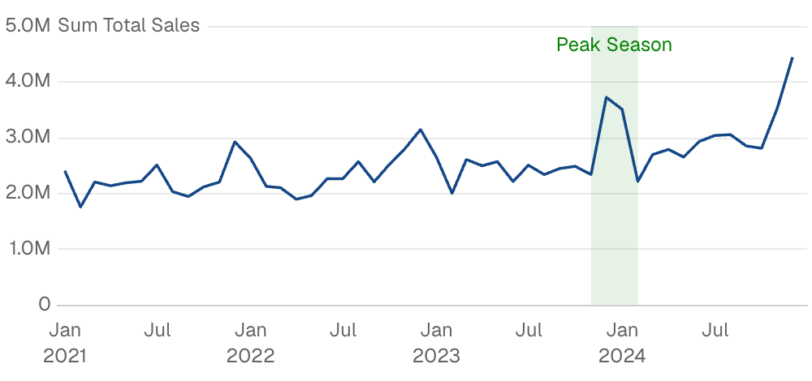
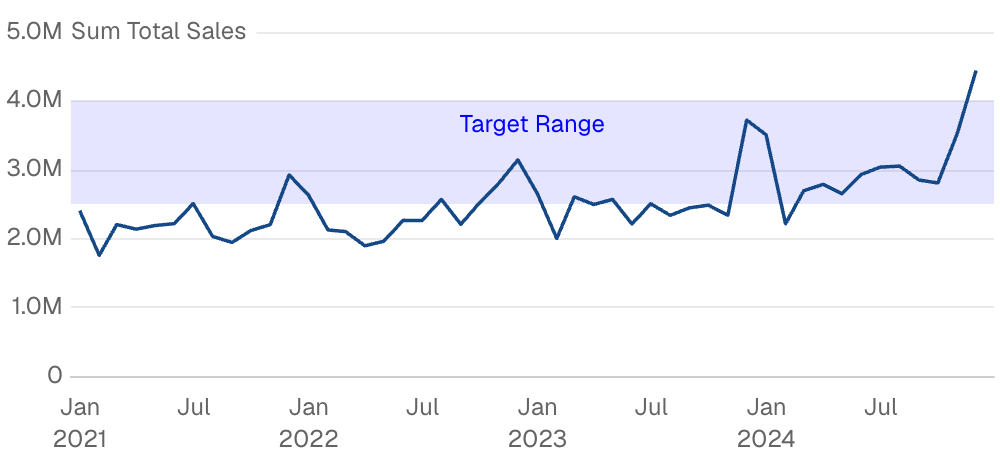
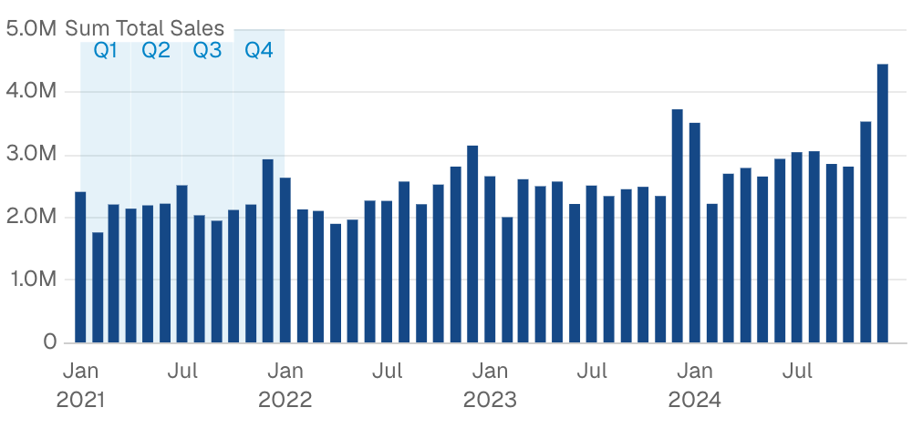
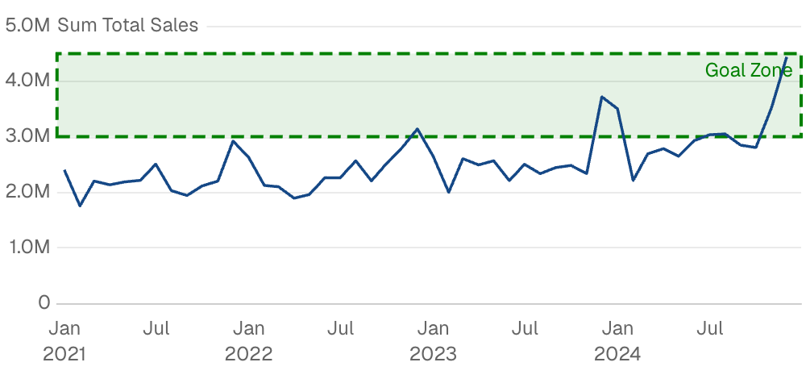

{/* THIS FILE IS AUTOMATICALLY GENERATED - DO NOT MODIFY DIRECTLY */}



````liquid

    

````

## Examples

### Highlight Date Range


````liquid

    

````

### Horizontal Value Band



````liquid

    

````

### Areas from Data



````liquid
```sql seasons
select '2021-01-01' as start_date, '2021-03-31' as end_date, 'Q1' as quarter
union all
select '2021-04-01', '2021-06-30', 'Q2'
union all
select '2021-07-01', '2021-09-30', 'Q3'
union all
select '2021-10-01', '2021-12-31', 'Q4'
```


    

````

### Custom Styling



````liquid

    

````

## Attributes

<ResponseField name="data" type="string">
  Query name to use for calculating dynamic area boundaries
</ResponseField>

<ResponseField name="label" type="string">
  Text label to display in the reference area
</ResponseField>

<ResponseField name="x_min" type="string | number">
  Left boundary of the area (e.g., a start date)
</ResponseField>

<ResponseField name="x_max" type="string | number">
  Right boundary of the area (e.g., an end date)
</ResponseField>

<ResponseField name="y_min" type="string | number">
  Bottom boundary of the area (e.g., a minimum value)
</ResponseField>

<ResponseField name="y_max" type="string | number">
  Top boundary of the area (e.g., a maximum value)
</ResponseField>

<ResponseField name="color" type="string" default="#0284c7">
  Fill color of the reference area
</ResponseField>

<ResponseField name="label_options" type="options group">
  Styling options for the label

**Example:**
```
label_options={
  position = "top_left"
  align = "left"
  color = "string"
  background_color = "string"
  padding = 0
  border = {
    width = 0
    type = "solid"
    color = "string"
    radius = 0
  }
  text = {
    size = 0
    bold = true
    italic = true
  }
}
```

**Attributes:**
- position: `string`
  - **Allowed values:**
    - `top_left`
    - `top`
    - `top_right`
    - `bottom_left`
    - `bottom`
    - `bottom_right`
    - `left`
    - `center`
    - `right`
- align: `string`
  - **Allowed values:**
    - `left`
    - `center`
    - `right`
- color: `string`
- background_color: `string`
- padding: `number`
- border: `options group`
  - **Options:**
    - width: `number`
    - type: `string`
      - **Allowed values:**
        - `solid`
        - `dashed`
        - `dotted`
    - color: `string`
    - radius: `number`
- text: `options group`
  - **Options:**
    - size: `number`
    - bold: `boolean`
    - italic: `boolean`

</ResponseField>

<ResponseField name="area_options" type="options group">
  Styling options for the area fill and border

**Example:**
```
area_options={
  color = "string"
  opacity = 0
  border = {
    width = 0
    type = "solid"
    color = "string"
  }
}
```

**Attributes:**
- color: `string`
- opacity: `number`
- border: `options group`
  - **Options:**
    - width: `number`
    - type: `string`
      - **Allowed values:**
        - `solid`
        - `dashed`
        - `dotted`
    - color: `string`

</ResponseField>


## Allowed Parents

- [area_chart](/components/area_chart)
- [bar_chart](/components/bar_chart)
- [bubble_chart](/components/bubble_chart)
- [combo_chart](/components/combo_chart)
- [horizontal_bar_chart](/components/horizontal_bar_chart)
- [line_chart](/components/line_chart)
- [scatter_chart](/components/scatter_chart)
