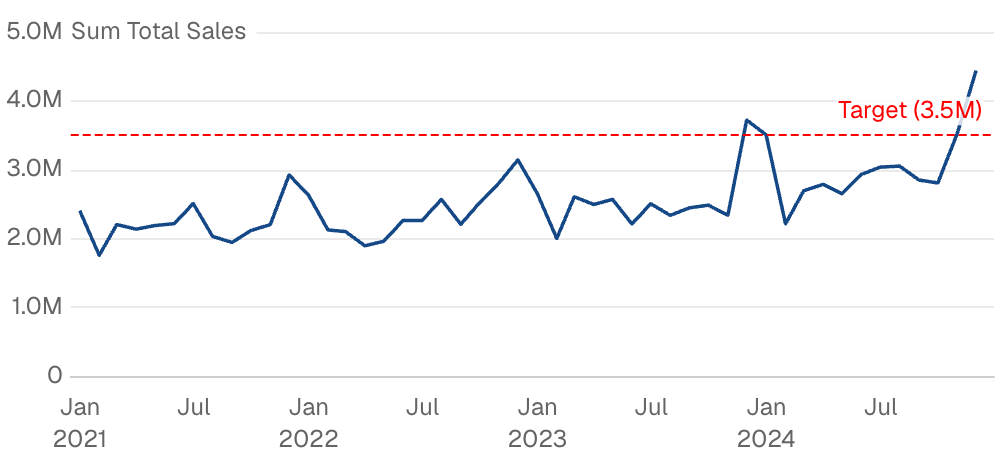
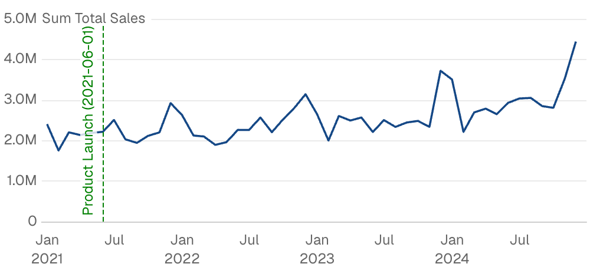
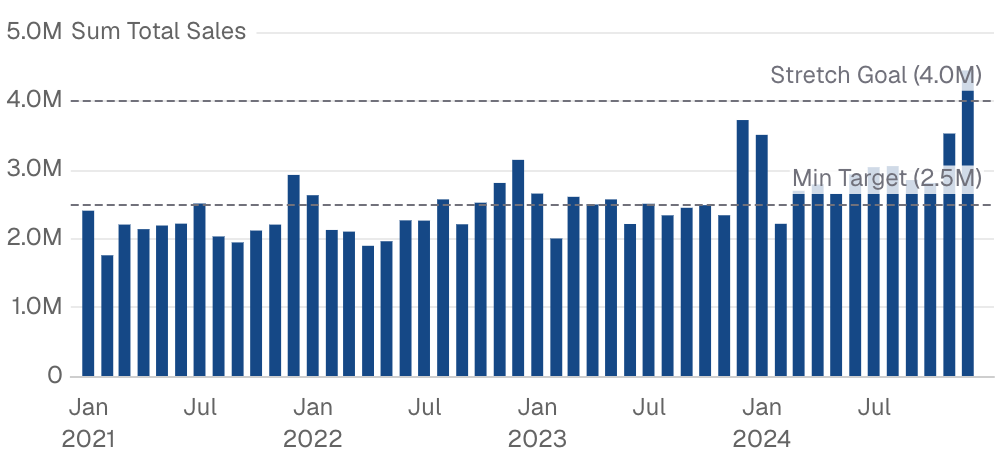
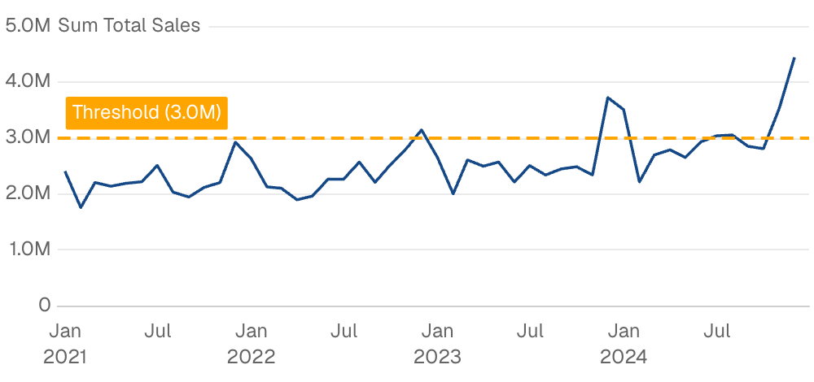
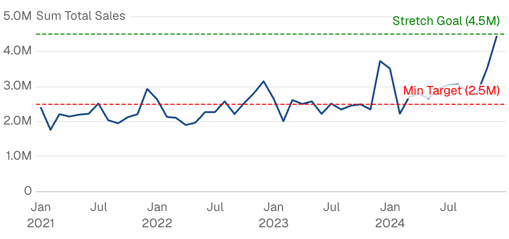

{/* THIS FILE IS AUTOMATICALLY GENERATED - DO NOT MODIFY DIRECTLY */}



````liquid

    

````

## Examples

### Horizontal Target Line


````liquid

    

````

### Vertical Line at Date



````liquid

    

````

### Reference Lines from Data



````liquid
```sql ref_lines
select 2500000 as ref, 'Min Target' as ref_label
union all
select 4000000, 'Stretch Goal'
```


    

````

### Custom Label Styling



````liquid

    

````

### Multiple Reference Lines



````liquid

    
    

````

## Attributes

<ResponseField name="data" type="string">
  Query name to use for calculating dynamic reference values
</ResponseField>

<ResponseField name="label" type="string">
  Text label to display on the reference line
</ResponseField>

<ResponseField name="x" type="string | number">
  X-axis value for a vertical reference line (e.g., a date or category)
</ResponseField>

<ResponseField name="y" type="string | number">
  Y-axis value for a horizontal reference line (e.g., a target or threshold)
</ResponseField>

<ResponseField name="x1" type="string | number">
  Starting x-coordinate for a sloped line
</ResponseField>

<ResponseField name="y1" type="string | number">
  Starting y-coordinate for a sloped line
</ResponseField>

<ResponseField name="x2" type="string | number">
  Ending x-coordinate for a sloped line
</ResponseField>

<ResponseField name="y2" type="string | number">
  Ending y-coordinate for a sloped line
</ResponseField>

<ResponseField name="color" type="string">
  Color of the reference line
</ResponseField>

<ResponseField name="label_options" type="options group">
  Styling options for the label

**Example:**
```
label_options={
  position = "above_end"
  align = "left"
  color = "string"
  background_color = "string"
  padding = 0
  fmt = "date"
  hide_value = true
  border = {
    width = 0
    type = "solid"
    color = "string"
    radius = 0
  }
  text = {
    size = 0
    bold = true
    italic = true
  }
}
```

**Attributes:**
- position: `string`
  - **Allowed values:**
    - `above_end`
    - `above_start`
    - `above_center`
    - `below_end`
    - `below_start`
    - `below_center`
- align: `string`
  - **Allowed values:**
    - `left`
    - `center`
    - `right`
- color: `string`
- background_color: `string`
- padding: `number`
- fmt: `string` - Format the label value. Defaults to series or axis fmt.
  - **Allowed values:** See [Value Formatting](/core-concepts/value-formatting) for all available formats.
- hide_value: `boolean`
- border: `options group`
  - **Options:**
    - width: `number`
    - type: `string`
      - **Allowed values:**
        - `solid`
        - `dashed`
        - `dotted`
    - color: `string`
    - radius: `number`
- text: `options group`
  - **Options:**
    - size: `number`
    - bold: `boolean`
    - italic: `boolean`

</ResponseField>

<ResponseField name="line_options" type="options group">
  Styling options for the line itself

**Example:**
```
line_options={
  color = "string"
  width = 0
  type = "solid"
  opacity = 0
}
```

**Attributes:**
- color: `string`
- width: `number` - Width of the line
- type: `string`
  - **Allowed values:**
    - `solid`
    - `dashed`
    - `dotted`
- opacity: `number` - Between 0 and 1

</ResponseField>

<ResponseField name="symbols" type="options group">
  Symbol shapes to display at line endpoints

**Example:**
```
symbols={
  start = {
    shape = "circle"
    size = 0
  }
  end = {
    shape = "circle"
    size = 0
  }
}
```

**Attributes:**
- start: `options group`
  - **Options:**
    - shape: `string`
      - **Allowed values:**
        - `circle`
        - `emptyCircle`
        - `rect`
        - `roundRect`
        - `triangle`
        - `diamond`
        - `pin`
        - `arrow`
        - `none`
        - `image://`
        - `path://`
    - size: `number`
- end: `options group`
  - **Options:**
    - shape: `string`
      - **Allowed values:**
        - `circle`
        - `emptyCircle`
        - `rect`
        - `roundRect`
        - `triangle`
        - `diamond`
        - `pin`
        - `arrow`
        - `none`
        - `image://`
        - `path://`
    - size: `number`

</ResponseField>


## Allowed Parents

- [area_chart](/components/area_chart)
- [bar_chart](/components/bar_chart)
- [bubble_chart](/components/bubble_chart)
- [combo_chart](/components/combo_chart)
- [horizontal_bar_chart](/components/horizontal_bar_chart)
- [line_chart](/components/line_chart)
- [scatter_chart](/components/scatter_chart)
