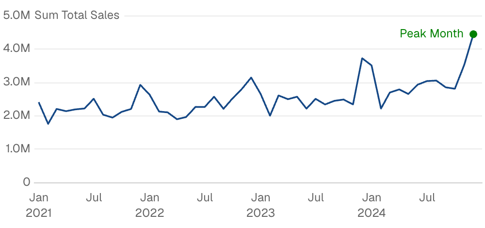
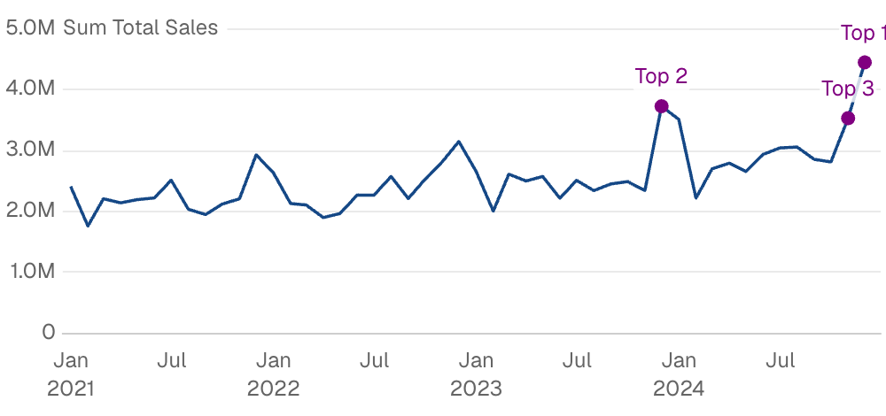
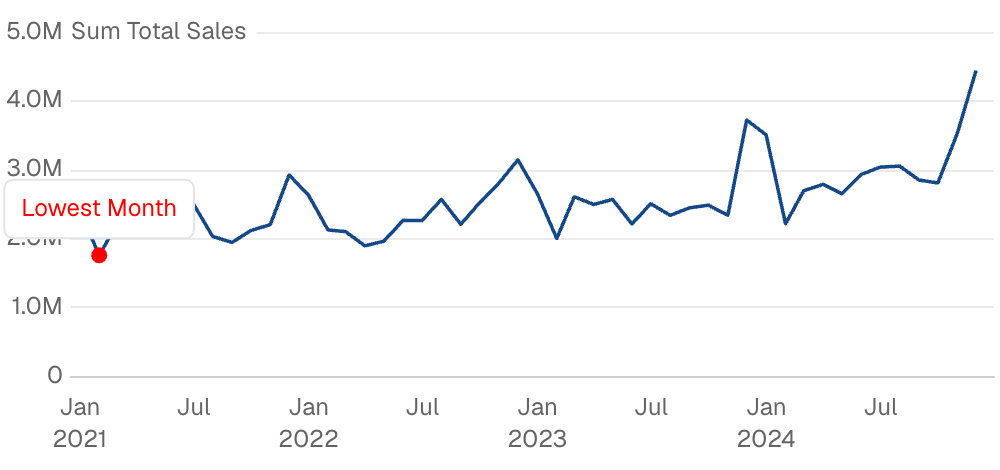
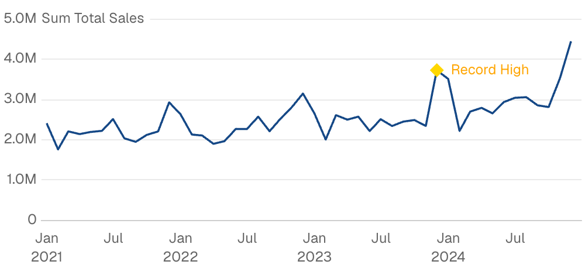

{/* THIS FILE IS AUTOMATICALLY GENERATED - DO NOT MODIFY DIRECTLY */}



````liquid

    

````

## Examples

### Hardcoded Point


````liquid

    

````

### Point from Data



````liquid
```sql top_months
select 
    toStartOfMonth(date) as month,
    sum(total_sales) as sales,
    'Top ' || row_number() over (order by sum(total_sales) desc) as label
from demo.daily_orders
group by month
order by sales desc
limit 3
```


    

````

### Callout Style



````liquid

    

````

### Custom Symbol



````liquid

    

````

## Attributes

<ResponseField name="data" type="string">
  Query name to use for placing multiple points from data
</ResponseField>

<ResponseField name="label" type="string">
  Text label to display at the reference point
</ResponseField>

<ResponseField name="color" type="string">
  Color of the point marker
</ResponseField>

<ResponseField name="x" type="string | number" required>
  X-axis position of the point (e.g., a date or category)
</ResponseField>

<ResponseField name="y" type="string | number" required>
  Y-axis position of the point (e.g., a value)
</ResponseField>

<ResponseField name="label_options" type="options group">
  Styling options for the label
</ResponseField>

<ResponseField name="symbol_options" type="options group">
  Styling options for the point marker

**Example:**
```
symbol_options={
  shape = "circle"
  size = 0
  color = "string"
}
```

**Attributes:**
- shape: `string`
  - **Allowed values:**
    - `circle`
    - `emptyCircle`
    - `rect`
    - `roundRect`
    - `triangle`
    - `diamond`
    - `pin`
    - `arrow`
    - `none`
    - `image://`
    - `path://`
- size: `number`
- color: `string`

</ResponseField>


## Allowed Parents

- [area_chart](/components/area_chart)
- [bar_chart](/components/bar_chart)
- [bubble_chart](/components/bubble_chart)
- [combo_chart](/components/combo_chart)
- [horizontal_bar_chart](/components/horizontal_bar_chart)
- [line_chart](/components/line_chart)
- [scatter_chart](/components/scatter_chart)
