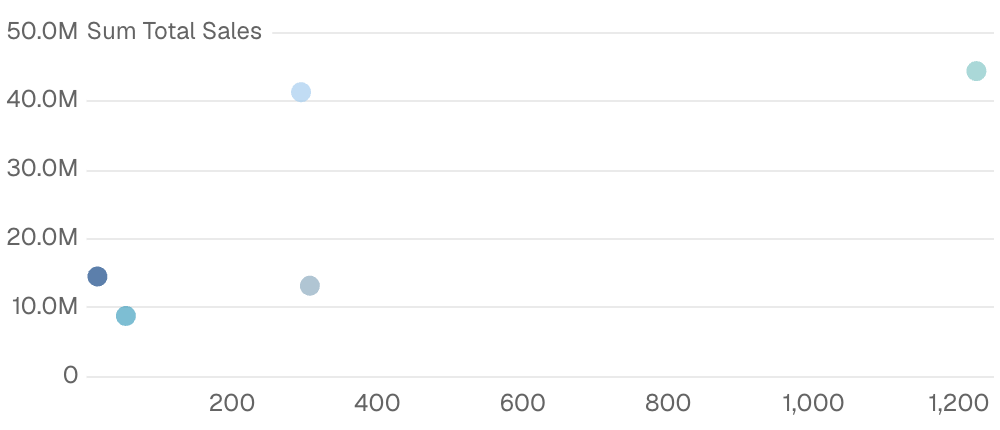
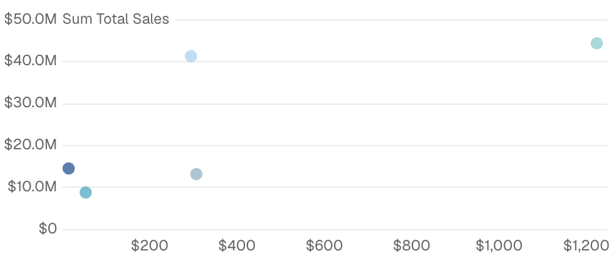
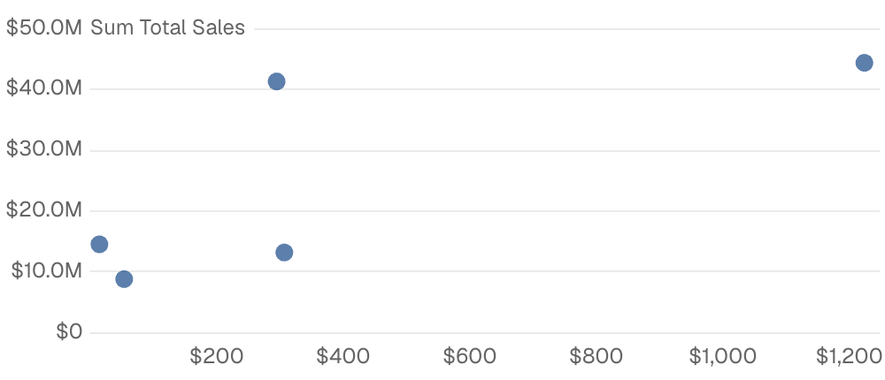

{/* THIS FILE IS AUTOMATICALLY GENERATED - DO NOT MODIFY DIRECTLY */}



````liquid

````

## Examples

### Basic Usage


````liquid

````

### Scatter Chart with Formatting



````liquid

````

### Scatter Chart with Point Titles



````liquid

````

## Attributes

<ResponseField name="data" type="string" required>
  Name of the table to query. Required unless every child series uses `metric="..."` — metric children resolve their own base from the metric view.
</ResponseField>

<ResponseField name="filters" type="array">
  IDs of filters to apply to the query
</ResponseField>

<ResponseField name="date_range" type="options group">
  Filter data to a time period. `date_range` is an OBJECT with `range` (the period) and optionally `date` (which column to filter on when the table has more than one). Shape: `date_range={ range="last 12 months" date="order_date" }`. `range` accepts predefined values (`last 7 days`, `month to date`), dynamic patterns (`Last 90 days`), custom windows (`2020-01-01 to 2023-03-01`), or partial ranges (`from 2020-01-01`, `until 2023-03-01`). Pass a plain string for `range` — the whole object is NOT a string.

**Example:**
```
date_range={
  range = "today"
  date = "string"
}
```

**Attributes:**
- range: `string` - Time period to filter. Use presets like 'last 7 days', dynamic patterns like 'Last 90 days', custom ranges like '2020-01-01 to 2023-03-01', or partial ranges like 'from 2020-01-01'.
  - **Allowed values:**
    - `today`
    - `yesterday`
    - `last 7 days`
    - `last 30 days`
    - `last 3 months`
    - `last 6 months`
    - `last 12 months`
    - `previous week`
    - `previous month`
    - `previous quarter`
    - `previous year`
    - `this week`
    - `this month`
    - `this quarter`
    - `this year`
    - `next week`
    - `next month`
    - `next quarter`
    - `next year`
    - `week to date`
    - `month to date`
    - `quarter to date`
    - `year to date`
    - `all time`
- date: `string` - Date column to filter on. Required when the data has multiple date columns.

</ResponseField>

<ResponseField name="date_grain" type="string">
  Bucket dates into a grain. Pass the raw date column as `x` and the chart truncates and groups for you. Temporal grains (`day`, `week`, `month`, `quarter`, `year`, `hour`) preserve the year — use for time-series. Seasonality grains (`day of week`, `day of month`, `day of year`, `week of year`, `month of year`, `quarter of year`) collapse across years — use for cyclical patterns like "which month sells most regardless of year".

**Allowed values:**
- `day`
- `week`
- `month`
- `quarter`
- `year`
- `hour`
- `day of week`
- `day of month`
- `day of year`
- `week of year`
- `month of year`
- `quarter of year`
</ResponseField>

<ResponseField name="handle_missing" type="string" default="connect">
  How to handle missing data points. "connect" auto-connects points (default), "gaps" shows visual breaks, "zero" fills with zeros.

**Allowed values:**
- `connect`
- `gaps`
- `zero`
</ResponseField>

<ResponseField name="x" type="string" required>
  Column name for x-axis. Required unless every child series uses `metric="..."` — metric children fall back to the metric view's time column.
</ResponseField>

<ResponseField name="x_fmt" type="string">
  Format for x values and axis labels. See [Value Formatting](/core-concepts/value-formatting) for available formats.
</ResponseField>

<ResponseField name="y_fmt" type="string">
  Format for y values and axis labels. See [Value Formatting](/core-concepts/value-formatting) for available formats.
</ResponseField>

<ResponseField name="y2_fmt" type="string">
  Format for y2 values and axis labels. See [Value Formatting](/core-concepts/value-formatting) for available formats.
</ResponseField>

<ResponseField name="series" type="string">
  Column name for series grouping (applies to all series)
</ResponseField>

<ResponseField name="point_title" type="string">
  Column name for individual point labels displayed at the top of the tooltip
</ResponseField>

<ResponseField name="title" type="string">
  Title to display above the component
</ResponseField>

<ResponseField name="subtitle" type="string">
  Subtitle to display below the title
</ResponseField>

<ResponseField name="info" type="string">
  Information tooltip text (can only be used with title). Displays an info icon next to the title.
</ResponseField>

<ResponseField name="info_link" type="string">
  URL to link the info text to (can only be used with info)
</ResponseField>

<ResponseField name="info_link_title" type="string">
  Create a custom link title for the info link, placed after the info text (can only be used with info_link)
</ResponseField>

<ResponseField name="refresh_interval" type="number">
  Time in seconds between automatic data refreshes (minimum 30). Overrides the page-level auto-refresh setting for this component.
</ResponseField>

<ResponseField name="where" type="string">
  Custom SQL WHERE condition to apply to the query. For date filters, use date_range instead.
</ResponseField>

<ResponseField name="having" type="string">
  Custom SQL HAVING condition to apply to the query after GROUP BY
</ResponseField>

<ResponseField name="limit" type="number">
  Maximum number of rows to return from the query. Note: When used with tables, limit will disable subtotals to prevent incomplete subtotal rows.
</ResponseField>

<ResponseField name="order" type="string">
  Column name(s) with optional direction (e.g. "column_name", "column_name desc")
</ResponseField>

<ResponseField name="qualify" type="string">
  Custom SQL QUALIFY condition to filter windowed results
</ResponseField>

<ResponseField name="width" type="number">
  Set the width of this component (in percent) relative to the page width
</ResponseField>

<ResponseField name="height" type="number">
  Set a fixed height for the chart in pixels
</ResponseField>

<ResponseField name="connect_group" type="string">
  Link this chart to others sharing the same id, syncing their tooltips, axis-pointer, and zoom
</ResponseField>

<ResponseField name="x_sort" type="string">
  Sort order for x-axis categories. Options: `asc` (alphabetical), `desc` (reverse alphabetical), `data` (preserve query order), or an array for custom order like `["A", "B", "C"]`. Prefer the newer `sort` prop for x/y direction sorting.

**Allowed values:**
- `asc`
- `desc`
- `data`
</ResponseField>

<ResponseField name="sort" type="string">
  Rarely useful on scatter — points position by (x, y) coordinates so `sort` can't move them. When a `series=` column is set, `sort` still influences which series ends up first in the legend and picks up the first color from the palette (a side effect of row order). Prefer `series_order=[...]` for legend order and `series_colors={...}` for stable colors. Accepts the same shapes as other charts (`"x asc"`, `"x desc"`, `"y asc"`, `"y desc"`, or an array) but the editor will warn when you use it here.

**Allowed values:**
- `x asc`
- `x desc`
- `y asc`
- `y desc`
</ResponseField>

<ResponseField name="y_axis_options" type="options group">
  Configure the y-axis

**Example:**
```
y_axis_options={
  title = "string"
  title_position = "top"
  ticks = true
  baseline = true
  labels = true
  gridlines = true
  min = 0
  max = 0
  fit_to_data = true
  interval = 0
}
```

**Attributes:**
- title: `string`
- title_position: `string` - Position of the axis title. "top" places it horizontally at the top, "side" places it vertically along the axis. Defaults to "side" for 100% stacked charts, "top" otherwise.
  - **Allowed values:**
    - `top`
    - `side`
- ticks: `boolean`
- baseline: `boolean`
- labels: `boolean` - Show/hide axis labels
- gridlines: `boolean` - Show/hide gridlines
- min: `number` - Minimum value for this axis (number for numeric axes, date string for date axes)
- max: `number` - Maximum value for this axis (number for numeric axes, date string for date axes)
- fit_to_data: `boolean` - Fit the axis to the data instead of including 0
- interval: `number` - Interval between axis ticks for numeric axes. This option is a suggestion, the actual interval may differ.

</ResponseField>

<ResponseField name="y2_axis_options" type="options group">
  Configure the secondary y-axis

**Example:**
```
y2_axis_options={
  title = "string"
  title_position = "top"
  ticks = true
  baseline = true
  labels = true
  gridlines = true
  min = 0
  max = 0
  fit_to_data = true
  interval = 0
}
```

**Attributes:**
- title: `string`
- title_position: `string` - Position of the axis title. "top" places it horizontally at the top, "side" places it vertically along the axis. Defaults to "side" for 100% stacked charts, "top" otherwise.
  - **Allowed values:**
    - `top`
    - `side`
- ticks: `boolean`
- baseline: `boolean`
- labels: `boolean` - Show/hide axis labels
- gridlines: `boolean` - Show/hide gridlines
- min: `number` - Minimum value for this axis (number for numeric axes, date string for date axes)
- max: `number` - Maximum value for this axis (number for numeric axes, date string for date axes)
- fit_to_data: `boolean` - Fit the axis to the data instead of including 0
- interval: `number` - Interval between axis ticks for numeric axes. This option is a suggestion, the actual interval may differ.

</ResponseField>

<ResponseField name="x_axis_options" type="options group">
  Configure the x-axis

**Example:**
```
x_axis_options={
  title = "string"
  show_title = true
  label_wrap = true
  ticks = true
  baseline = true
  labels = true
  gridlines = true
  min = 0
  max = 0
  fit_to_data = true
  min_interval = "year"
  max_interval = "year"
  interval = 0
  label_rotate = 0
  title_arrow = true
  max_label_length = 0
}
```

**Attributes:**
- title: `string`
- show_title: `boolean` - When `true`, renders the auto-derived axis title (the x column name) below the chart. Ignored when `title` is set explicitly. Defaults to `false` — auto-derived column-name titles usually read as visual noise and the axis labels speak for themselves.
- label_wrap: `boolean`
- ticks: `boolean`
- baseline: `boolean`
- labels: `boolean` - Show/hide axis labels
- gridlines: `boolean` - Show/hide gridlines
- min: `number` - Minimum value for this axis (number for numeric axes, date string for date axes)
- max: `number` - Maximum value for this axis (number for numeric axes, date string for date axes)
- fit_to_data: `boolean` - Fit the axis to the data instead of including 0. Defaults to true for numeric x-axes, false otherwise.
- min_interval: `string` - Minimum interval between axis ticks for time-based axes. This option is a suggestion, the actual interval may differ.
  - **Allowed values:**
    - `year`
    - `quarter`
    - `month`
    - `week`
    - `day`
    - `hour`
- max_interval: `string` - Maximum interval between axis ticks for time-based axes. This option is a suggestion, the actual interval may differ.
  - **Allowed values:**
    - `year`
    - `quarter`
    - `month`
    - `week`
    - `day`
    - `hour`
- interval: `number` - Interval between axis ticks for numeric axes. This option is a suggestion, the actual interval may differ.
- label_rotate: `number` - Rotation angle of axis label in degrees. Positive values rotate clockwise, negative values rotate counter-clockwise.
- title_arrow: `boolean` - Show/hide the arrow (→) on the axis title
- max_label_length: `number` - Maximum character length for axis labels. Labels exceeding this length will be truncated with an ellipsis. Defaults to 20 characters when labels are rotated.

</ResponseField>

<ResponseField name="legend" type="boolean" default="true">
  Show legend. Studio's built-in legend renders a compact color swatch + series name. For chart-wide style overrides that need the legend to reflect them precisely (line width, custom symbols, richer styling), set `legend=false` and provide `legend={ show=true ... }` inside `echarts_options` to use ECharts' native legend instead.
</ResponseField>

<ResponseField name="legend_location" type="string" default="top">
  Position of the legend (top or bottom)

**Allowed values:**
- `top`
- `bottom`
</ResponseField>

<ResponseField name="series_order" type="array">
  Array of series names to define the order of series in the chart and legend. Series not in the array will appear after the ordered ones.
</ResponseField>

<ResponseField name="chart_options" type="options group">
  Studio-shaped chart styling shortcuts (palette, series colors, zoom, padding). For raw ECharts overrides, use `echarts_options` instead.

**Example:**
```
chart_options={
  color_palette = ["#3b82f6", "#8b5cf6", "#ec4899"]
  series_colors = {
    "Series A" = "#3b82f6"
    "Series B" = "#10b981"
    "Series C" = "#f59e0b"
  }
  zoom = true
  top_padding = 0
}
```

**Attributes:**
- color_palette: `array of strings` - Array of hex color codes to use for series colors
- series_colors: `map of key-value pairs` - Map of series names to hex color codes for custom series coloring
- zoom: `boolean` - Enables zoom by dragging on the chart area
- top_padding: `number` - Additional padding (in px) above the chart area to prevent labels from being cut off

</ResponseField>

<ResponseField name="echarts_options" type="map">
  Raw [ECharts options](https://echarts.apache.org/en/option.html) deep-merged over the chart's final configuration. Use for anything the structured props do not expose — `dataZoom`, `visualMap`, `graphic`, tooltip styling, and so on. Partial overrides win key-by-key without clobbering Studio's computed siblings. For per-series overrides, use `echarts_series_options` or the per-series `echarts_options` on a `line`/`bar`/etc. child.

**Example:**
```
echarts_options={
    tooltip={ position="top" }
    dataZoom=[{ type="slider" }]
}
```
</ResponseField>

<ResponseField name="echarts_series_options" type="map">
  Raw [ECharts series options](https://echarts.apache.org/en/option.html#series) deep-merged into every data series in the chart. Use when the same override should apply to all series. Skips reference lines/areas/points. For a single series, set `echarts_options` on the series child instead.

**Example:**
```
echarts_series_options={
    itemStyle={ borderRadius=8 }
    markLine={ data=[{ type="average" }] }
}
```
</ResponseField>

<ResponseField name="y" type="string | array" required>
  Column name for y-axis
</ResponseField>

<ResponseField name="metric" type="string">
  Semantic metric name to display, from metrics/*.yaml. Use instead of the raw data/value/x/y attributes.
</ResponseField>

<ResponseField name="fmt" type="string">
  Format for this series' values. See [Value Formatting](/core-concepts/value-formatting) for available formats.
</ResponseField>

<ResponseField name="tooltip_fields" type="array">
  Extra columns to include in the tooltip on hover. Each entry is `{ value, label?, fmt?, color_by_sign?, down_is_good? }`. See the [tooltip fields guide](/components/tooltip-fields) for examples.
</ResponseField>

<ResponseField name="data_labels" type="options group">
  Label each point in the series with its value

**Example:**
```
data_labels={
  position = "above"
  fmt = "date"
  size = 0
  distance = 0
  rotate = 0
  color = "string"
  border_color = "string"
  show_overlap = true
}
```

**Attributes:**
- position: `string` - Position the label relative to its data point
  - **Allowed values:**
    - `above`
    - `below`
    - `left`
    - `right`
    - `middle`
- fmt: `string` - Format the label value. Defaults to series or axis fmt.
  - **Allowed values:** See [Value Formatting](/core-concepts/value-formatting) for all available formats.
- size: `number` - Font size in px
- distance: `number` - How far the label is from the data point
- rotate: `number` - Rotate each label (degrees)
- color: `string` - Change the text color of the labels
- border_color: `string` - Change the border color surrounding text labels, defaults to chart background
- show_overlap: `boolean` - Show labels for every point even when they overlap

</ResponseField>

<ResponseField name="opacity" type="number" default="0.7">
  The opacity of the series
</ResponseField>

<ResponseField name="y2" type="string | array">
  Column name for secondary y-axis
</ResponseField>

<ResponseField name="size" type="string">
  Column name for size of scatter points
</ResponseField>

<ResponseField name="size_fmt" type="string">
  Format for size values in tooltips. See [Value Formatting](/core-concepts/value-formatting) for available formats.
</ResponseField>

## Allowed Children

- [reference_line](/components/reference_line)
- [reference_area](/components/reference_area)
- [reference_point](/components/reference_point)


