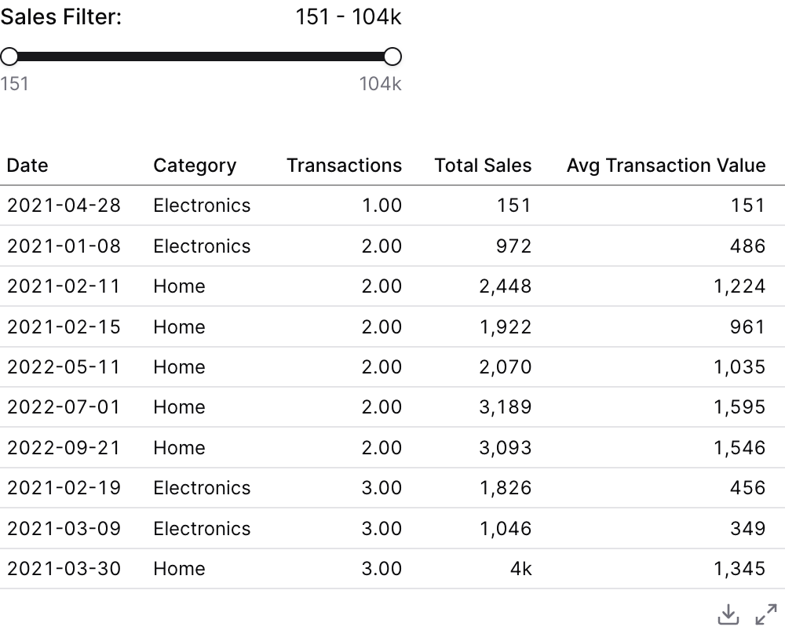

{/* THIS FILE IS AUTOMATICALLY GENERATED - DO NOT MODIFY DIRECTLY */}


````liquid



````

## Examples

### Using `filters`


````liquid



````

### Using `where`


````liquid



````

### Using Inline SQL



````liquid


```sql filtered_orders
select * from demo.daily_orders
where total_sales {{sales_filter.between}}
```


````

## Attributes

<ResponseField name="id" type="string" required>
  The id of the slider to be used in a `filters` prop
</ResponseField>

<ResponseField name="title" type="string">
  Text displayed above the slider
</ResponseField>

<ResponseField name="info" type="string">
  Information tooltip text
</ResponseField>

<ResponseField name="info_link" type="string">
  URL to link the info text to (can only be used with info)
</ResponseField>

<ResponseField name="info_link_title" type="string">
  Create a custom link title for the info link, placed after the info text (can only be used with info_link)
</ResponseField>

<ResponseField name="data" type="string">
  Name of the table to query for min/max values
</ResponseField>

<ResponseField name="value_column" type="string">
  SQL expression to get min/max values from. When provided with data, queries MIN(value_column) and MAX(value_column) to set the slider range.
</ResponseField>

<ResponseField name="min" type="number">
  Minimum value for the slider
</ResponseField>

<ResponseField name="max" type="number">
  Maximum value for the slider
</ResponseField>

<ResponseField name="step" type="number" default="1">
  Step size for the slider (must be greater than 0)
</ResponseField>

<ResponseField name="snap_to_step" type="boolean" default="true">
  If true, automatically adjusts min/max to align with step boundaries for cleaner numbers (e.g., range 15-103818 with step=10000 becomes 0-110000)
</ResponseField>

<ResponseField name="fmt" type="string" default="num">
  Format code for the slider values (e.g., "num", "usd", "pct"). See formatValue documentation for available formats. See [Value Formatting](/core-concepts/value-formatting) for available formats.
</ResponseField>

<ResponseField name="range" type="boolean" default="false">
  If true, enables range mode with two handles for selecting a min/max range
</ResponseField>

<ResponseField name="initial_value" type="number | array">
  Initial selected value (number for single value, [min, max] array for range mode)
</ResponseField>

<ResponseField name="show_input" type="boolean" default="false">
  If true, shows a number input next to the slider value for direct editing
</ResponseField>

<ResponseField name="date_range" type="options group">
  Filter data to a time period. `date_range` is an OBJECT with `range` (the period) and optionally `date` (which column to filter on when the table has more than one). Shape: `date_range={ range="last 12 months" date="order_date" }`. `range` accepts predefined values (`last 7 days`, `month to date`), dynamic patterns (`Last 90 days`), custom windows (`2020-01-01 to 2023-03-01`), or partial ranges (`from 2020-01-01`, `until 2023-03-01`). Pass a plain string for `range` — the whole object is NOT a string.

**Example:**
```
date_range={
  range = "today"
  date = "string"
}
```

**Attributes:**
- range: `string` - Time period to filter. Use presets like 'last 7 days', dynamic patterns like 'Last 90 days', custom ranges like '2020-01-01 to 2023-03-01', or partial ranges like 'from 2020-01-01'.
  - **Allowed values:**
    - `today`
    - `yesterday`
    - `last 7 days`
    - `last 30 days`
    - `last 3 months`
    - `last 6 months`
    - `last 12 months`
    - `previous week`
    - `previous month`
    - `previous quarter`
    - `previous year`
    - `this week`
    - `this month`
    - `this quarter`
    - `this year`
    - `next week`
    - `next month`
    - `next quarter`
    - `next year`
    - `week to date`
    - `month to date`
    - `quarter to date`
    - `year to date`
    - `all time`
- date: `string` - Date column to filter on. Required when the data has multiple date columns.

</ResponseField>

## Using the Filter Variable

Reference this filter using `{{filter_id}}`. The value returned depends on where you use it.

| Context | Default Property | No Selection | Result |
|---------|-----------------|--------------|--------|
| Inline SQL query | `.value` |  | `500` |
| `where` attribute | `.value` |  | `500` |
| Text / Markdown | `.value` |  | `500` |

### Available Properties

You can also access specific properties using `{{filter_id.property}}`:

#### .value
Returns the numeric slider value, or the selected range when in range mode.

````liquid


```sql filtered_users
select * from users
where age >= {{age_filter}}
```
````

**Example value:** `500`

#### .filter
Returns a complete SQL filter expression. Returns `true` when no value is selected. Only available when `value_column` is provided.

````liquid


```sql filtered_users
select * from users
where {{age_filter.filter}}
```
````

**Example value:** `age >= 25`

#### .literal
Returns the raw numeric value. Only available in single value mode.

````liquid


```sql filtered_products
select * from products
where price >= {{price_filter.literal}}
```
````

**Example value:** `500`

#### .min
Returns the minimum value of the selected range. Only available when range mode is enabled.

````liquid


```sql filtered_users
select * from users
where age >= {{age_filter.min}}
```
````

**Example value:** `25`

#### .max
Returns the maximum value of the selected range. Only available when range mode is enabled.

````liquid


```sql filtered_users
select * from users
where age <= {{age_filter.max}}
```
````

**Example value:** `65`

#### .between
Returns a SQL BETWEEN clause fragment. Only available when range mode is enabled.

````liquid


```sql filtered_products
select * from products
where sale_price {{price_filter.between}}
```
````

**Example value:** `BETWEEN 25 AND 65`


