{/* THIS FILE IS AUTOMATICALLY GENERATED - DO NOT MODIFY DIRECTLY */}


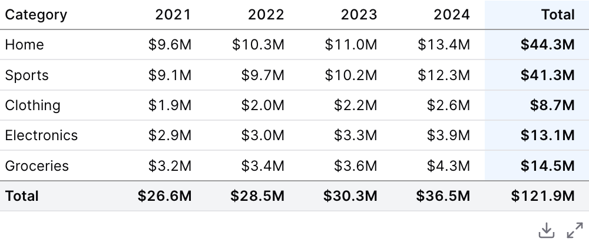
````liquid

    
    
    

````

## Examples

### Basic Usage


````liquid

    
    
    

````

### Date Range Filtering

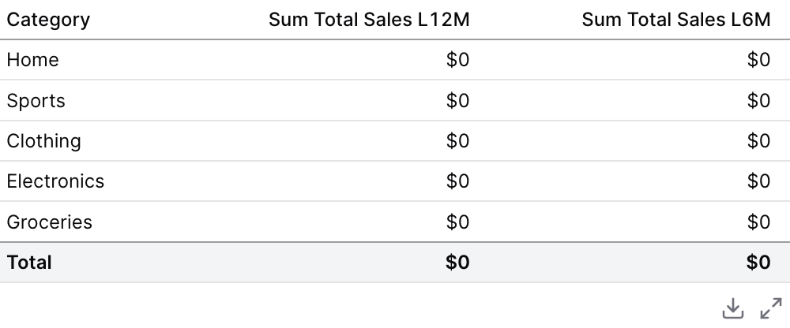

````liquid

  
  
  

````

### Pivoting


````liquid

  
  
  

````

### Prior Year Comparison

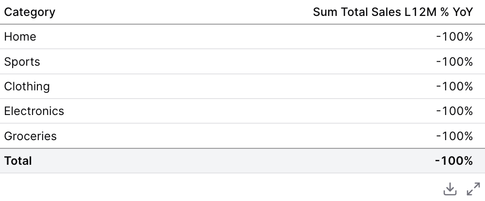

````liquid

  
  

````

### Calculated Measures

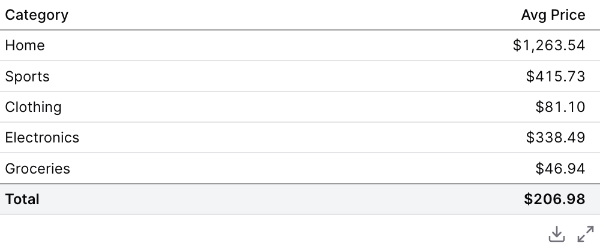

````liquid

  
  

````

### Custom Grouping

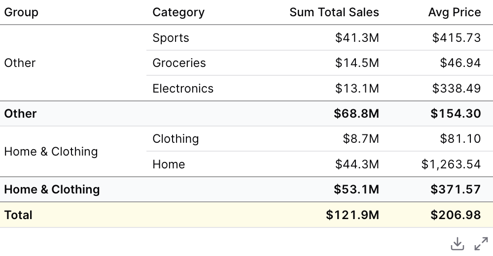

````liquid

  
  
  
  

````

### Viz: Color Scale

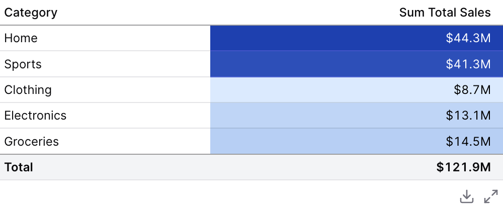

````liquid

  
  

````

### Viz: Color Scale with Custom Colors

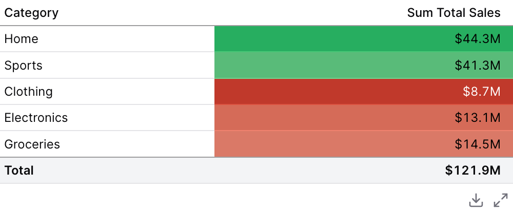

````liquid

  
  

````

### Viz: Bar

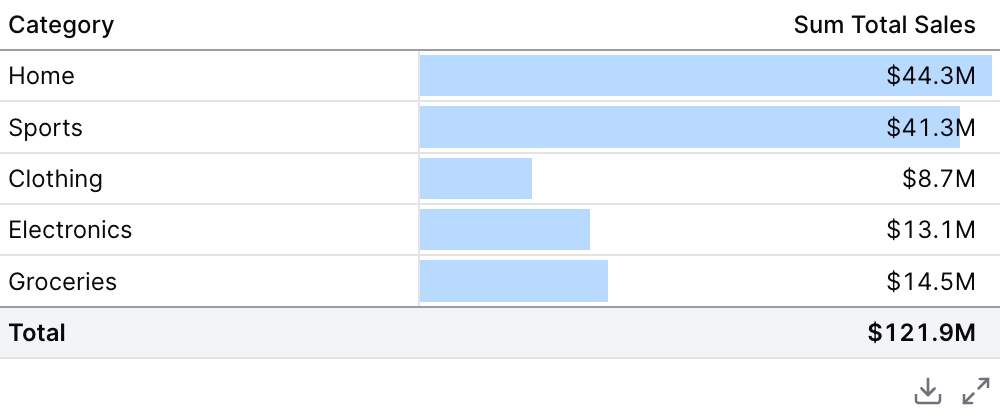

````liquid

  
  

````

### Viz: Bar with Custom Colors

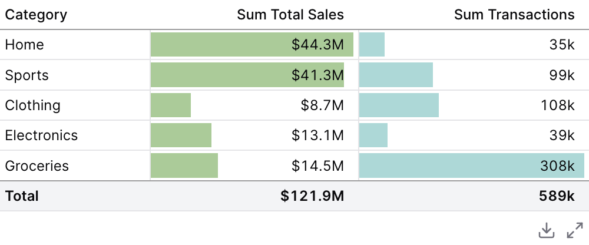

````liquid

  
  
  

````

### Viz: Delta

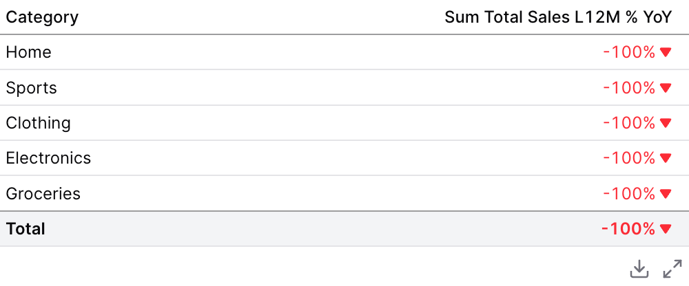

````liquid

  
  

````

### Viz: Sparkline

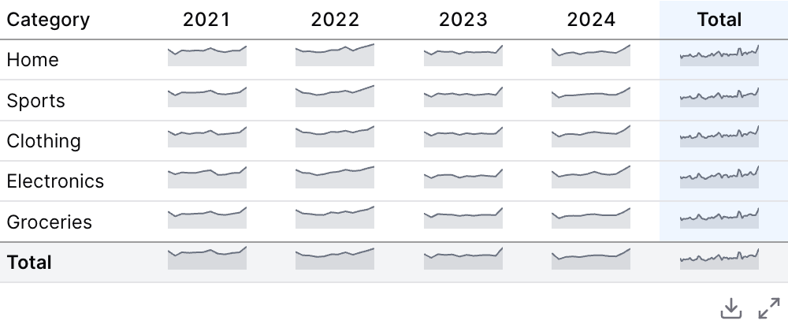

````liquid

  
  
  

````

### Links

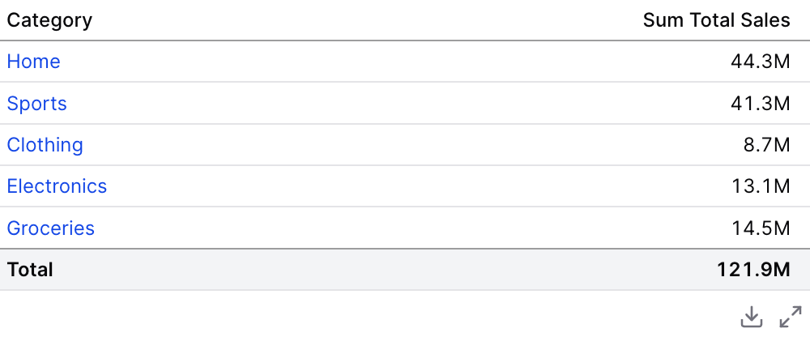

````liquid

  
  

````

### Column Info

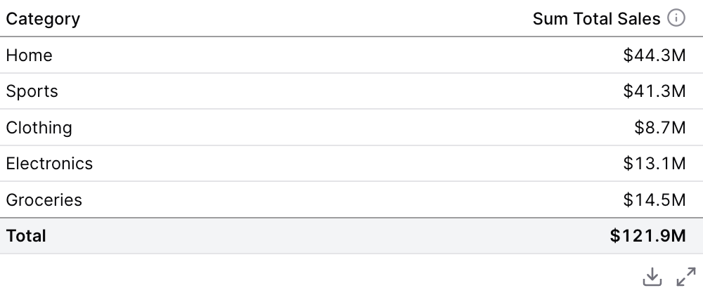

````liquid

  
  

````

### Sorting

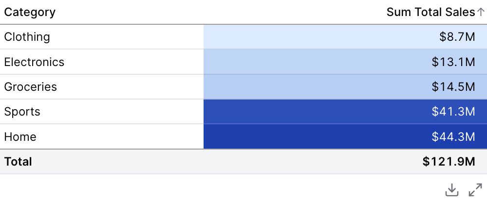

````liquid

  
  

````

### Date Grains: Day of Week

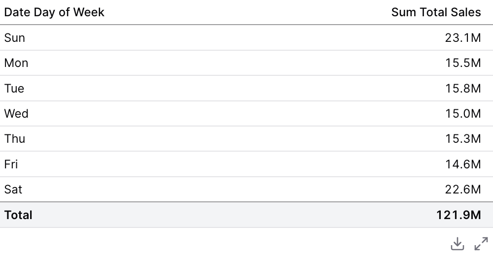

````liquid

  
  

````

### Repeat Dimension Values

````liquid

  
  
  

````

## Attributes

<ResponseField name="data" type="string">
  
</ResponseField>

<ResponseField name="filters" type="array">
  
</ResponseField>

<ResponseField name="date_range" type="options group">
  Filter data to a time period. `date_range` is an OBJECT with `range` (the period) and optionally `date` (which column to filter on when the table has more than one). Shape: `date_range={ range="last 12 months" date="order_date" }`. `range` accepts predefined values (`last 7 days`, `month to date`), dynamic patterns (`Last 90 days`), custom windows (`2020-01-01 to 2023-03-01`), or partial ranges (`from 2020-01-01`, `until 2023-03-01`). Pass a plain string for `range` — the whole object is NOT a string.

**Example:**
```
date_range={
  range = "today"
  date = "string"
}
```

**Attributes:**
- range: `string` - Time period to filter. Use presets like 'last 7 days', dynamic patterns like 'Last 90 days', custom ranges like '2020-01-01 to 2023-03-01', or partial ranges like 'from 2020-01-01'.
  - **Allowed values:**
    - `today`
    - `yesterday`
    - `last 7 days`
    - `last 30 days`
    - `last 3 months`
    - `last 6 months`
    - `last 12 months`
    - `previous week`
    - `previous month`
    - `previous quarter`
    - `previous year`
    - `this week`
    - `this month`
    - `this quarter`
    - `this year`
    - `next week`
    - `next month`
    - `next quarter`
    - `next year`
    - `week to date`
    - `month to date`
    - `quarter to date`
    - `year to date`
    - `all time`
- date: `string` - Date column to filter on. Required when the data has multiple date columns.

</ResponseField>

<ResponseField name="where" type="string">
  Custom SQL WHERE condition to apply to the query. For date filters, use date_range instead.
</ResponseField>

<ResponseField name="having" type="string">
  Custom SQL HAVING condition to apply to the query after GROUP BY
</ResponseField>

<ResponseField name="limit" type="number">
  Maximum number of rows to return from the query. Note: When used with tables, limit will disable subtotals to prevent incomplete subtotal rows.
</ResponseField>

<ResponseField name="order" type="string">
  Column name(s) with optional direction (e.g. "column_name", "column_name desc")
</ResponseField>

<ResponseField name="qualify" type="string">
  Custom SQL QUALIFY condition to filter windowed results
</ResponseField>

<ResponseField name="title" type="string">
  Title to display above the table
</ResponseField>

<ResponseField name="subtitle" type="string">
  Subtitle to display below the title
</ResponseField>

<ResponseField name="info" type="string">
  Info text to display in a tooltip next to the title. Can only be used with the title prop.
</ResponseField>

<ResponseField name="info_link" type="string">
  URL to link the info text to (can only be used with info)
</ResponseField>

<ResponseField name="info_link_title" type="string">
  Create a custom link title for the info link, placed after the info text (can only be used with info_link)
</ResponseField>

<ResponseField name="dimensions" type="array">
  Array of dimension column names or SQL expressions. Each item must be a string (e.g., ["column_name", "count(category) as count"])
</ResponseField>

<ResponseField name="pivots" type="array">
  Array of pivot column names or SQL expressions. These will be pivoted in the table output. Each item must be a string (e.g., ["category", "region"])
</ResponseField>

<ResponseField name="measures" type="array">
  Array of SQL expressions for aggregations. Each item must be a string (e.g., ["sum(transactions)", "avg(value) as average"])
</ResponseField>

<ResponseField name="subtotals" type="boolean" default="true">
  Whether to include subtotals and totals in the table
</ResponseField>

<ResponseField name="total_label" type="string" default="Total">
  The label to display in total/subtotal rows and columns. Useful when using non-sum aggregations like avg, min, max, or count.
</ResponseField>

<ResponseField name="show_total_row" type="boolean" default="true">
  Whether to display the total row at the bottom. Only applies when subtotals=true. Note: Temporal comparisons may hide totals even when this is true.
</ResponseField>

<ResponseField name="show_subtotal_rows" type="boolean" default="true">
  Whether to display intermediate subtotal rows. Only applies when subtotals=true. Note: Temporal comparisons may hide subtotals even when this is true.
</ResponseField>

<ResponseField name="show_total_column" type="boolean" default="true">
  Whether to display the total column in pivoted tables. Only applies when subtotals=true and pivots are used.
</ResponseField>

<ResponseField name="show_subtotal_columns" type="boolean" default="true">
  Whether to display intermediate subtotal columns in pivoted tables. Only applies when subtotals=true and pivots are used.
</ResponseField>

<ResponseField name="measures_first" type="boolean" default="false">
  Whether to put measures before pivots in the column hierarchy (e.g., Sales > 2021|2022 instead of 2021|2022 > Sales)
</ResponseField>

<ResponseField name="page_size" type="number" default="10">
  Number of rows to display per page in pagination (maximum 200)
</ResponseField>

<ResponseField name="search" type="boolean" default="false">
  Whether to display a search box above the table for filtering results
</ResponseField>

<ResponseField name="format_titles" type="boolean" default="true">
  Whether to apply formatting to column titles. When false, titles will be displayed as-is.
</ResponseField>

<ResponseField name="wrap_titles" type="boolean" default="true">
  Whether to allow column titles to wrap across multiple lines. When false, titles will be on a single line.
</ResponseField>

<ResponseField name="wrap" type="boolean" default="false">
  Whether to allow table cell content to wrap across multiple lines. When false, cell content will be on a single line.
</ResponseField>

<ResponseField name="row_shading" type="boolean">
  Whether to apply alternating background colors to table rows for easier reading.
</ResponseField>

<ResponseField name="row_lines" type="boolean">
  Whether to display borders between table rows. When false, row borders are hidden.
</ResponseField>

<ResponseField name="link" type="string">
  Column name containing URLs to make each row clickable. When specified, clicking a row will navigate to the URL in that column.
</ResponseField>

<ResponseField name="show_link_column" type="boolean" default="false">
  Whether to display the link column in the table. Only applies when no explicit columns are specified and the link prop is used.
</ResponseField>

<ResponseField name="refresh_interval" type="number">
  Time in seconds between automatic data refreshes (minimum 30). Overrides the page-level auto-refresh setting for this component.
</ResponseField>

<ResponseField name="freeze_columns" type="number" default="0">
  Number of left-most columns to freeze when scrolling horizontally. Frozen columns remain visible while the rest of the table scrolls.
</ResponseField>

<ResponseField name="repeat_values" type="boolean" default="false">
  Whether to repeat dimension values on every row. When true, dimension values are displayed on every row even when they are the same as the row above.
</ResponseField>

<ResponseField name="collapsible" type="boolean" default="false">
  Whether to enable collapsible groups. When enabled, subtotal rows become clickable to expand/collapse their child rows. Only works when subtotals are enabled and there are dimensions. Note: pagination is disabled when collapsible is enabled.
</ResponseField>

<ResponseField name="collapsed" type="boolean">
  Whether all groups should start collapsed on initial load. Defaults to true when collapsible=true.
</ResponseField>

<ResponseField name="subtotal_position" type="string">
  Where to position subtotal rows relative to their group data rows. "top" places subtotals before the detail rows, "bottom" places them after. Defaults to "top" when collapsible=true, otherwise "bottom".

**Allowed values:**
- `top`
- `bottom`
</ResponseField>

<ResponseField name="total_position" type="string" default="bottom">
  Where to position the grand total row. "top" places it as the first row, "bottom" places it as the last row (default).

**Allowed values:**
- `top`
- `bottom`
</ResponseField>

<ResponseField name="row_conditional_colors" type="string">
  SQL expression that returns a hex color for each row's background. Used to conditionally highlight entire rows based on data (e.g., "case when sum(amount) > 10000 then '#dcfce7' else null end").
</ResponseField>

<ResponseField name="width" type="number">
  Set the width of this component (in percent) relative to the page width
</ResponseField>

## Allowed Children

- [dimension](/components/dimension)
- [measure](/components/measure)
- [pivot](/components/pivot)


