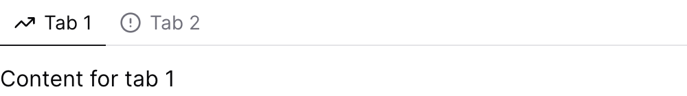
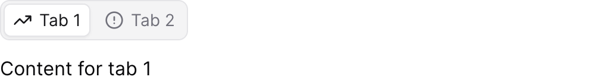

{/* THIS FILE IS AUTOMATICALLY GENERATED - DO NOT MODIFY DIRECTLY */}



````liquid

	
		Content for tab 1
	
	
		Content for tab 2
	

````

## Examples

### Basic Usage


````liquid

	
		Content for tab 1
	
	
		Content for tab 2
	

````

### Well Variant



````liquid

	
		Content for tab 1
	
	
		Content for tab 2
	

````

## Attributes

<ResponseField name="variant" type="string" default="default">
  Visual style variant of the tabs

**Allowed values:**
- `default`
- `well`
</ResponseField>

<ResponseField name="full_width" type="boolean" default="false">
  Whether the tabs should take the full width of their container
</ResponseField>

<ResponseField name="color" type="string">
  Custom color for active tab text and underline. Uses CSS color values.
</ResponseField>

<ResponseField name="align" type="string" default="left">
  Horizontal alignment of tabs. Note: align right only affects the default variant.

**Allowed values:**
- `left`
- `right`
</ResponseField>

<ResponseField name="print_break" type="string" default="auto">
  Controls page breaks inside this component in PDF exports. `auto` allows content to flow across pages, `avoid` attempts to keep all content together on one page.

**Allowed values:**
- `auto`
- `avoid`
</ResponseField>

<ResponseField name="width" type="number">
  Set the width of this component (in percent) relative to the page width
</ResponseField>

## Allowed Children

- [tab](/components/tab)


