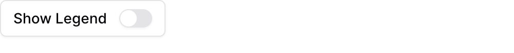
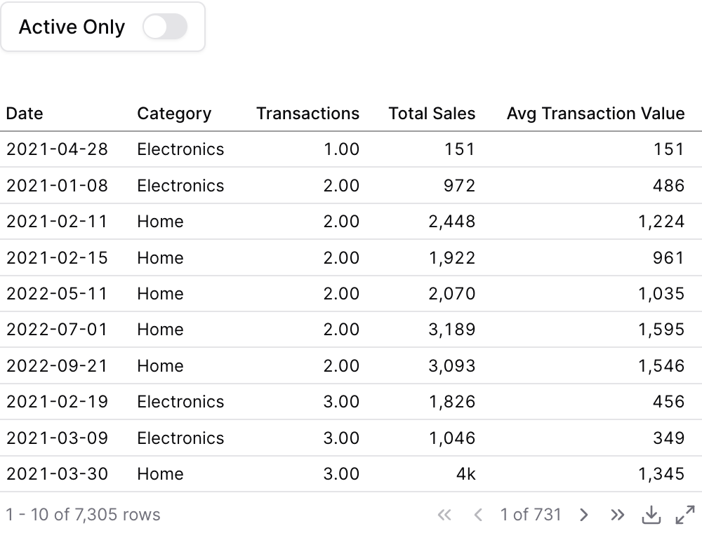

{/* THIS FILE IS AUTOMATICALLY GENERATED - DO NOT MODIFY DIRECTLY */}



````liquid

````

## Examples

### Basic Usage


````liquid

````

### Using `where`


````liquid



````

### Using Inline SQL



````liquid


```sql filtered_orders
select * from demo.daily_orders
where {{active_only}} = false or total_sales > 1000
```


````

## Attributes

<ResponseField name="id" type="string" required>
  The id of the toggle to be used in a `filters` prop
</ResponseField>

<ResponseField name="label" type="string">
  Text displayed next to the toggle inside the box. Defaults to the id if not provided.
</ResponseField>

<ResponseField name="info" type="string">
  Information tooltip text that appears after the label
</ResponseField>

<ResponseField name="invert" type="boolean" default="false">
  Invert the boolean value output. When true, checked = false and unchecked = true. Useful when toggle label semantics are opposite to the filter logic (e.g., a "Show inactive" toggle that filters for is_active = false when checked).
</ResponseField>

<ResponseField name="initial_value" type="boolean" default="false">
  Initial state of the toggle
</ResponseField>

## Using the Filter Variable

Reference this filter using `{{filter_id}}`. The value returned depends on where you use it.

| Context | Default Property | No Selection | Result |
|---------|-----------------|--------------|--------|
| Inline SQL query | `.value` |  | `true` |
| `where` attribute | `.value` |  | `true` |
| Text / Markdown | `.value` |  | `true` |

### Available Properties

You can also access specific properties using `{{filter_id.property}}`:

#### .value
Returns the boolean value of the toggle.

````liquid


```sql active_users
select * from users
where is_active = {{active_filter}}
```
````

**Example value:** `true`


