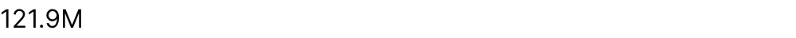

{/* THIS FILE IS AUTOMATICALLY GENERATED - DO NOT MODIFY DIRECTLY */}



````liquid

````

## Examples

### Basic Usage


````liquid

````

## Attributes

<ResponseField name="data" type="string">
  Table or view to query. Omit when using `metric`.
</ResponseField>

<ResponseField name="metric" type="string">
  Semantic metric name to display, from metrics/*.yaml. Use instead of the raw data/value/x/y attributes.
</ResponseField>

<ResponseField name="value" type="string">
  SQL expression to insert into the SELECT part of the query (e.g., "COUNT(*)", "SUM(sales)"). Omit when using `metric`.
</ResponseField>

<ResponseField name="className" type="string">
  CSS class to apply to the value
</ResponseField>

<ResponseField name="fmt" type="string">
  Format code for the value (e.g., "num", "usd", "pct"). See formatValue documentation for available formats. See [Value Formatting](/core-concepts/value-formatting) for available formats.
</ResponseField>

<ResponseField name="color" type="string">
  CSS color to apply to the value (e.g., "red", "#ff0000", "rgb(255,0,0)")
</ResponseField>

<ResponseField name="redNegatives" type="boolean">
  When true, negative values will be displayed in red (rgb(220 38 38))
</ResponseField>

<ResponseField name="info" type="string">
  Information tooltip text (can only be used with title)
</ResponseField>

<ResponseField name="info_link" type="string">
  URL to link the info text to (can only be used with info)
</ResponseField>

<ResponseField name="info_link_title" type="string">
  Create a custom link title for the info link, placed after the info text (can only be used with info_link)
</ResponseField>

<ResponseField name="comparison" type="options group">
  Comparison configuration object

**Example:**
```
comparison={
  compare_vs = "prior year"
  display_type = "compared_value"
  target = "string"
  benchmark = {
    agg = "avg"
    subject = "store_name"
    within = ["region"]
  }
  hide_pct = true
  pct_fmt = "string"
  abs_fmt = "string"
}
```

**Attributes:**
- compare_vs: `string` - Type of comparison to perform. Options: prior year (same period last year), prior period (previous period of same duration), target (compare against a target value), benchmark (compare against group average/aggregate)
  - **Allowed values:**
    - `prior year`
    - `prior period`
    - `target`
    - `benchmark`
- display_type: `string` - What to display for comparison. Options: compared_value (comparison period value), abs (absolute change), pct (percentage change). Default: pct
  - **Allowed values:**
    - `compared_value`
    - `abs`
    - `pct`
- target: `string` - Target value for target comparison. Can be a column name, aggregation (e.g., "sum(target_sales)"), or literal value.
- benchmark: `options group`
  - **Options:**
    - agg: `string` - Aggregation function to apply across benchmark group. Options: avg (average), median, min, max, sum, count, count_distinct
      - **Allowed values:**
        - `avg`
        - `median`
        - `min`
        - `max`
        - `sum`
        - `count`
        - `count_distinct`
    - subject: `string` - Column or expression that defines individual entities in the benchmark (e.g., "store_name", "customer_id"). Required for single-value components.
    - value: `string` - Optional column or expression to use for benchmark calculation. If not specified, uses the main value column. Useful if you have a pre-aggregated benchmark table for RLS reasons.
    - within: `array of strings` - Dimension columns to group the benchmark by (e.g., ["region"]). Leave empty for dataset-wide benchmark.
    - where: `string` - SQL WHERE clause to filter which entities are included in the benchmark
    - exclude_self: `boolean` - Exclude the current row from its own benchmark calculation (table context only). Default: false
- hide_pct: `boolean` - Hide the percentage change line in comparison tooltips
- pct_fmt: `string` - Format code for percentage values in comparison tooltips
- abs_fmt: `string` - Format code for absolute values in comparison tooltips

</ResponseField>

<ResponseField name="filters" type="array">
  IDs of filters to apply to the query
</ResponseField>

<ResponseField name="refresh_interval" type="number">
  Time in seconds between automatic data refreshes (minimum 30). Overrides the page-level auto-refresh setting for this component.
</ResponseField>

<ResponseField name="where" type="string">
  Custom SQL WHERE condition to apply to the query. For date filters, use date_range instead.
</ResponseField>

<ResponseField name="having" type="string">
  Custom SQL HAVING condition to apply to the query after GROUP BY
</ResponseField>

<ResponseField name="limit" type="number">
  Maximum number of rows to return from the query. Note: When used with tables, limit will disable subtotals to prevent incomplete subtotal rows.
</ResponseField>

<ResponseField name="order" type="string">
  Column name(s) with optional direction (e.g. "column_name", "column_name desc")
</ResponseField>

<ResponseField name="qualify" type="string">
  Custom SQL QUALIFY condition to filter windowed results
</ResponseField>

<ResponseField name="date_range" type="options group">
  Filter data to a time period. `date_range` is an OBJECT with `range` (the period) and optionally `date` (which column to filter on when the table has more than one). Shape: `date_range={ range="last 12 months" date="order_date" }`. `range` accepts predefined values (`last 7 days`, `month to date`), dynamic patterns (`Last 90 days`), custom windows (`2020-01-01 to 2023-03-01`), or partial ranges (`from 2020-01-01`, `until 2023-03-01`). Pass a plain string for `range` — the whole object is NOT a string.

**Example:**
```
date_range={
  range = "today"
  date = "string"
}
```

**Attributes:**
- range: `string` - Time period to filter. Use presets like 'last 7 days', dynamic patterns like 'Last 90 days', custom ranges like '2020-01-01 to 2023-03-01', or partial ranges like 'from 2020-01-01'.
  - **Allowed values:**
    - `today`
    - `yesterday`
    - `last 7 days`
    - `last 30 days`
    - `last 3 months`
    - `last 6 months`
    - `last 12 months`
    - `previous week`
    - `previous month`
    - `previous quarter`
    - `previous year`
    - `this week`
    - `this month`
    - `this quarter`
    - `this year`
    - `next week`
    - `next month`
    - `next quarter`
    - `next year`
    - `week to date`
    - `month to date`
    - `quarter to date`
    - `year to date`
    - `all time`
- date: `string` - Date column to filter on. Required when the data has multiple date columns.

</ResponseField>

<ResponseField name="width" type="number">
  Set the width of this component (in percent) relative to the page width
</ResponseField>


