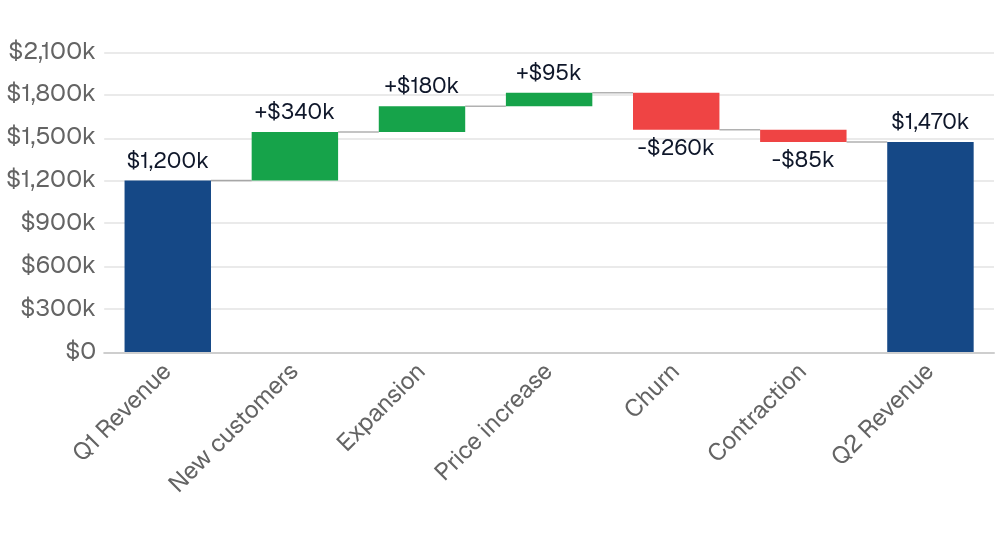
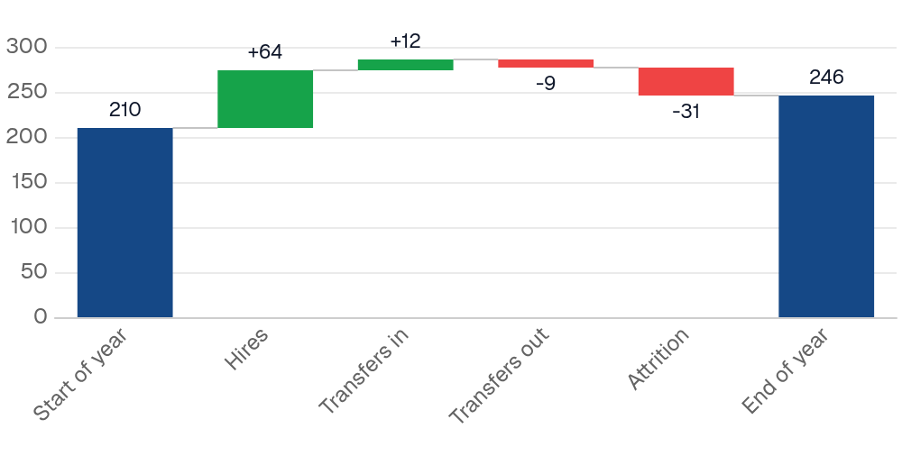
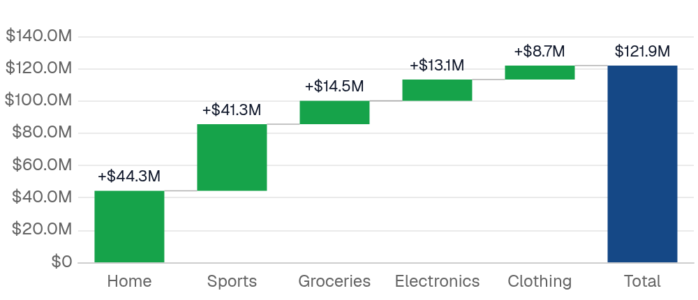
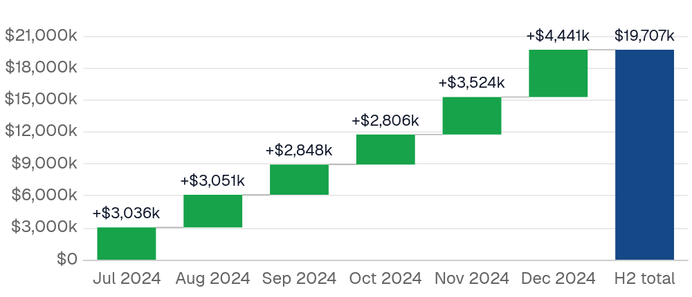
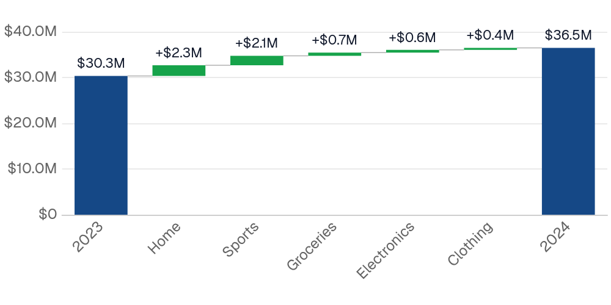
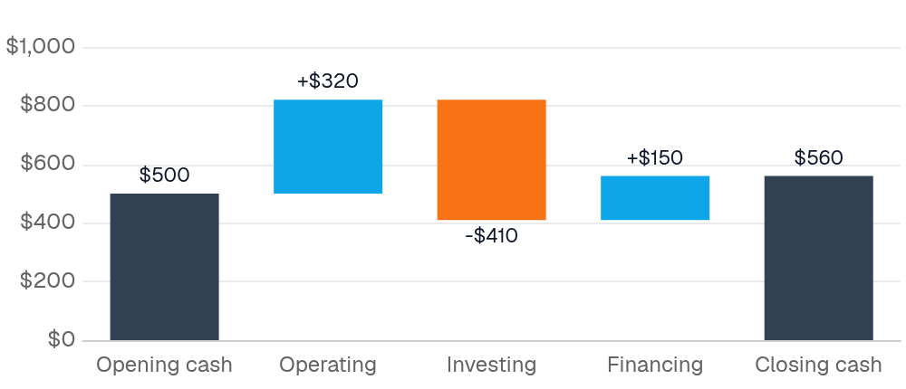

{/* THIS FILE IS AUTOMATICALLY GENERATED - DO NOT MODIFY DIRECTLY */}



````liquid
```sql revenue_bridge
SELECT 1 AS step_order, 'Q1 Revenue' AS step, 1200000 AS amount, 'total' AS bar_type
UNION ALL SELECT 2, 'New customers', 340000, 'change'
UNION ALL SELECT 3, 'Expansion', 180000, 'change'
UNION ALL SELECT 4, 'Price increase', 95000, 'change'
UNION ALL SELECT 5, 'Churn', -260000, 'change'
UNION ALL SELECT 6, 'Contraction', -85000, 'change'
UNION ALL SELECT 7, 'Q2 Revenue', NULL, 'total'
```


````

## Examples

### Basic Usage


````liquid
```sql revenue_bridge
SELECT 1 AS step_order, 'Q1 Revenue' AS step, 1200000 AS amount, 'total' AS bar_type
UNION ALL SELECT 2, 'New customers', 340000, 'change'
UNION ALL SELECT 3, 'Expansion', 180000, 'change'
UNION ALL SELECT 4, 'Price increase', 95000, 'change'
UNION ALL SELECT 5, 'Churn', -260000, 'change'
UNION ALL SELECT 6, 'Contraction', -85000, 'change'
UNION ALL SELECT 7, 'Q2 Revenue', NULL, 'total'
```


````

### Marking totals by label



````liquid
```sql headcount
SELECT 1 AS step_order, 'Start of year' AS step, 210 AS people
UNION ALL SELECT 2, 'Hires', 64
UNION ALL SELECT 3, 'Transfers in', 12
UNION ALL SELECT 4, 'Transfers out', -9
UNION ALL SELECT 5, 'Attrition', -31
```


````

### From raw data



````liquid

````

### Build-up over time



````liquid

````

### Change between periods, by dimension



````liquid

````

### Custom colors and no connectors



````liquid
```sql cash_flow
SELECT 1 AS step_order, 'Opening cash' AS step, 500 AS amount, 'total' AS kind
UNION ALL SELECT 2, 'Operating', 320, 'change'
UNION ALL SELECT 3, 'Investing', -410, 'change'
UNION ALL SELECT 4, 'Financing', 150, 'change'
```


````

## Data structure


One row per bar, in display order. `x` is the label and `y` is the change: positive rises, negative falls. Running totals are computed by the chart; do not pre-compute them in SQL.

**Pre-summarized rows** (a plain `y` column) are read in query order. SQL does not guarantee an order without `ORDER BY`, so include a step number and pass `order="step_order"`, or list the labels in `x_sort`.

**Raw rows** (an aggregate `y` such as `sum(amount)`) are grouped by `x` and sorted largest change first. Override with `x_sort` or `order`.

### Totals

A total bar is drawn from zero and resets the running total. Mark total rows with `bar_type="kind"` (a column whose value is `total` or `subtotal`) or `totals=["Start", "End"]` (a list of labels). A total row with a `NULL` value takes the running total, so an "End" row needs no value. Unless the last row is a total, a computed **Total** bar is appended; set `total=false` to suppress it.


## Patterns


| Your data | Write |
| --- | --- |
| One row per bar | plain `y`, `order`, `totals` or `bar_type` |
| Events with a column that is the bar label | `x` = that column, `y="sum(…)"` |
| Events over time | `x` = date, `date_grain`, `x_sort="asc"` |
| Events whose bar label is derived | SQL labels each row; `y="sum(…)"`, `order="min(step_order)"` |
| Bridge between two balances | SQL: start total, grouped movements, `NULL` end; `bar_type`, `order` |
| Before/after snapshots by a dimension | `x` = period, `breakdown` = dimension |

### One row per bar

| step_order | step | amount |
| --- | --- | --- |
| 1 | Opening cash | 500 |
| 2 | Operating | 320 |
| 3 | Investing | -410 |
| 4 | Financing | 150 |

````liquid

````

### Events with a bar-label column

| txn_id | date | category | amount |
| --- | --- | --- | --- |
| 1 | 2024-07-02 | Product sales | 1200 |
| 2 | 2024-07-02 | Refunds | -80 |
| 3 | 2024-07-03 | Product sales | 950 |
| 4 | 2024-07-03 | Shipping fees | 60 |

````liquid

````

For a build-up over time, use `x="date" date_grain="month" x_sort="asc"` on the same table.

### Events whose bar label is derived

Label each row in SQL, keeping the sign, and let the chart aggregate.

````liquid
```sql revenue_lines
SELECT 1 AS step_order, 'Gross sales' AS step, qty * unit_price AS amount FROM orders
UNION ALL SELECT 2, 'Discounts', -(qty * unit_price * discount_pct / 100) FROM orders
UNION ALL SELECT 3, 'Returns', -(qty * unit_price) FROM orders WHERE returned
```


````

### Bridge between two balances

The start is a total, the movements are a `GROUP BY`, and the end is a `NULL` total the chart computes. If the computed end differs from the real closing balance, the movements do not reconcile.

````liquid
```sql arr_bridge
SELECT 0 AS step_order, 'Q1 ARR' AS step, sum(arr) AS amount, 'total' AS kind
FROM arr_snapshots WHERE snapshot_date = '2024-03-31'
UNION ALL
SELECT CASE movement_type WHEN 'new' THEN 1 WHEN 'expansion' THEN 2 WHEN 'contraction' THEN 3 ELSE 4 END,
       movement_type, sum(delta), 'change'
FROM arr_movements WHERE date BETWEEN '2024-04-01' AND '2024-06-30'
GROUP BY movement_type
UNION ALL
SELECT 9, 'Q2 ARR', NULL, 'total'
```


````

Subscription data has no movement column; derive one by comparing each customer's value at the start and end of the period and classifying the difference (new, expansion, contraction, churn) in a `CASE`.

### Before/after snapshots by a dimension

| period | segment | revenue |
| --- | --- | --- |
| 2023 | Enterprise | 4.0M |
| 2023 | SMB | 1.5M |
| 2024 | Enterprise | 4.8M |
| 2024 | SMB | 1.9M |

````liquid

````

Draws **2023** → Enterprise +0.8M → SMB +0.4M → **2024**. With more periods the pattern repeats between each consecutive pair; `breakdown_limit` folds small contributors into an "Other" bar. A value present in only one period counts as moving from or to zero.


## Styling


Per-kind colors are set in `chart_options`: `increase_color`, `decrease_color`, `total_color`, `label_color` (a color, or `inherit` to match each bar) and `connector_color`.

`echarts_options` deep-merges over the whole chart configuration, as on other charts.

The bars, labels and connectors are drawn by a custom series, so `echarts_series_options` supports these keys:

| Key | Applies to | Fields |
| --- | --- | --- |
| `itemStyle` | bars | `color`, `opacity`, `borderColor`, `borderWidth`, `borderType`, `borderRadius` |
| `label` | value labels | `show`, `color` (including `inherit`), `fontSize`, `fontWeight`, `fontFamily`, `fontStyle`, `opacity` |
| `lineStyle` | connectors | `color`, `width`, `opacity`, `type` |

Other series keys (`z`, `silent`, animation) pass through unchanged.


## Attributes

<ResponseField name="data" type="string" required>
  Name of the table or view to query
</ResponseField>

<ResponseField name="filters" type="array">
  IDs of filters to apply to the query
</ResponseField>

<ResponseField name="date_range" type="options group">
  Filter data to a time period. `date_range` is an OBJECT with `range` (the period) and optionally `date` (which column to filter on when the table has more than one). Shape: `date_range={ range="last 12 months" date="order_date" }`. `range` accepts predefined values (`last 7 days`, `month to date`), dynamic patterns (`Last 90 days`), custom windows (`2020-01-01 to 2023-03-01`), or partial ranges (`from 2020-01-01`, `until 2023-03-01`). Pass a plain string for `range` — the whole object is NOT a string.

**Example:**
```
date_range={
  range = "today"
  date = "string"
}
```

**Attributes:**
- range: `string` - Time period to filter. Use presets like 'last 7 days', dynamic patterns like 'Last 90 days', custom ranges like '2020-01-01 to 2023-03-01', or partial ranges like 'from 2020-01-01'.
  - **Allowed values:**
    - `today`
    - `yesterday`
    - `last 7 days`
    - `last 30 days`
    - `last 3 months`
    - `last 6 months`
    - `last 12 months`
    - `previous week`
    - `previous month`
    - `previous quarter`
    - `previous year`
    - `this week`
    - `this month`
    - `this quarter`
    - `this year`
    - `next week`
    - `next month`
    - `next quarter`
    - `next year`
    - `week to date`
    - `month to date`
    - `quarter to date`
    - `year to date`
    - `all time`
- date: `string` - Date column to filter on. Required when the data has multiple date columns.

</ResponseField>

<ResponseField name="date_grain" type="string">
  Bucket dates into a grain. Pass the raw date column as `x` and the chart truncates and groups for you. Temporal grains (`day`, `week`, `month`, `quarter`, `year`, `hour`) preserve the year — use for time-series. Seasonality grains (`day of week`, `day of month`, `day of year`, `week of year`, `month of year`, `quarter of year`) collapse across years — use for cyclical patterns like "which month sells most regardless of year".

**Allowed values:**
- `day`
- `week`
- `month`
- `quarter`
- `year`
- `hour`
- `day of week`
- `day of month`
- `day of year`
- `week of year`
- `month of year`
- `quarter of year`
</ResponseField>

<ResponseField name="x" type="string" required>
  Column that labels each bar. With an aggregate `y`, one bar per distinct value; add `date_grain` to bucket a date column.
</ResponseField>

<ResponseField name="y" type="string" required>
  The change for each bar: positive rises, negative falls. A plain column reads pre-summarized rows in query order; an aggregate such as `sum(amount)` groups raw rows by `x`. On a total row, `y` is the absolute total.
</ResponseField>

<ResponseField name="bar_type" type="string">
  Column that marks total rows. Values `total` or `subtotal` (case-insensitive) draw a bar from zero and reset the running total; anything else is a change.
</ResponseField>

<ResponseField name="breakdown" type="string">
  Explain the change between consecutive `x` values by this column. Each `x` value becomes a total bar; between two totals, one bar per `breakdown` value shows how much it moved. Requires an aggregate `y`. Cannot be combined with `bar_type`, `totals` or `tooltip_fields`.
</ResponseField>

<ResponseField name="breakdown_limit" type="number">
  With `breakdown`, keep this many contributors per span (by absolute change) and fold the rest into an "Other" bar.
</ResponseField>

<ResponseField name="totals" type="array">
  `x` labels of the total rows, e.g. `totals=["Starting ARR", "Ending ARR"]`. An alternative to `bar_type` when the query has no marker column. An entry that matches no row is an error.
</ResponseField>

<ResponseField name="total" type="boolean" default="true">
  Append a computed total bar after the last row. Skipped when the last row is already a total.
</ResponseField>

<ResponseField name="total_label" type="string" default="Total">
  Label for the computed total bar
</ResponseField>

<ResponseField name="x_sort" type="string">
  Bar order. By default a plain `y` keeps query order and an aggregate `y` sorts largest change first. `asc`/`desc` sort by label, `value_asc`/`value_desc` by change, or pass a label array such as `["Start", "New", "Churn"]`. `order` (raw SQL) overrides all of these.

**Allowed values:**
- `asc`
- `desc`
- `value_asc`
- `value_desc`
</ResponseField>

<ResponseField name="title" type="string">
  Title to display above the component
</ResponseField>

<ResponseField name="subtitle" type="string">
  Subtitle to display below the title
</ResponseField>

<ResponseField name="info" type="string">
  Information tooltip text (can only be used with title). Displays an info icon next to the title.
</ResponseField>

<ResponseField name="info_link" type="string">
  URL to link the info text to (can only be used with info)
</ResponseField>

<ResponseField name="info_link_title" type="string">
  Create a custom link title for the info link, placed after the info text (can only be used with info_link)
</ResponseField>

<ResponseField name="x_fmt" type="string">
  Format for bar labels on the x-axis (useful when `x` is a date). See [Value Formatting](/core-concepts/value-formatting) for available formats.
</ResponseField>

<ResponseField name="y_fmt" type="string">
  Format for values — applied to the y-axis, data labels and tooltip. See [Value Formatting](/core-concepts/value-formatting) for available formats.
</ResponseField>

<ResponseField name="labels" type="boolean" default="true">
  Show the value on each bar, signed for changes. Labels hide when the bars are too narrow for them.
</ResponseField>

<ResponseField name="connectors" type="boolean" default="true">
  Draw the line joining each bar to the next
</ResponseField>

<ResponseField name="legend" type="boolean" default="true">
  Show an Increase / Decrease / Total legend for the kinds present
</ResponseField>

<ResponseField name="legend_location" type="string" default="top">
  Position of the legend

**Allowed values:**
- `top`
- `bottom`
</ResponseField>

<ResponseField name="chart_options" type="options group">
  Waterfall chart configuration options

**Attributes:**
- increase_color: `string` - Color for bars that rise. Defaults to the theme positive color.
- decrease_color: `string` - Color for bars that fall. Defaults to the theme negative color.
- total_color: `string` - Color for total bars. Defaults to the first theme palette color.
- label_color: `string` - Color for value labels, or `inherit` to match each bar. Defaults to the theme foreground.
- connector_color: `string` - Color of the connector lines. Defaults to the theme muted foreground.

</ResponseField>

<ResponseField name="y_axis_options" type="options group">
  Configure the y-axis

**Attributes:**
- title: `string` - Axis title shown above the axis
- labels: `boolean` - Show/hide axis labels
- gridlines: `boolean` - Show/hide gridlines
- ticks: `boolean`
- baseline: `boolean` - Show/hide the axis line
- min: `number` - Minimum axis value
- max: `number` - Maximum axis value
- fit_to_data: `boolean` - Fit the axis to the bars instead of including 0. Totals then start from the axis minimum; useful when changes are small relative to the totals.
- interval: `number` - Interval between axis ticks. A suggestion — the actual interval may differ.

</ResponseField>

<ResponseField name="x_axis_options" type="options group">
  Configure the x-axis

**Attributes:**
- labels: `boolean` - Show/hide axis labels
- ticks: `boolean`
- baseline: `boolean` - Show/hide the axis line
- gridlines: `boolean` - Show/hide gridlines
- label_rotate: `number` - Rotation of axis labels in degrees. Overrides the automatic rotation.

</ResponseField>

<ResponseField name="refresh_interval" type="number">
  Time in seconds between automatic data refreshes (minimum 30). Overrides the page-level auto-refresh setting for this component.
</ResponseField>

<ResponseField name="where" type="string">
  Custom SQL WHERE condition to apply to the query. For date filters, use date_range instead.
</ResponseField>

<ResponseField name="having" type="string">
  Custom SQL HAVING condition to apply to the query after GROUP BY
</ResponseField>

<ResponseField name="limit" type="number">
  Maximum number of rows to return from the query. Note: When used with tables, limit will disable subtotals to prevent incomplete subtotal rows.
</ResponseField>

<ResponseField name="order" type="string">
  Column name(s) with optional direction (e.g. "column_name", "column_name desc")
</ResponseField>

<ResponseField name="qualify" type="string">
  Custom SQL QUALIFY condition to filter windowed results
</ResponseField>

<ResponseField name="width" type="number">
  Set the width of this component (in percent) relative to the page width
</ResponseField>

<ResponseField name="height" type="number">
  Set a fixed height for the chart in pixels
</ResponseField>

<ResponseField name="connect_group" type="string">
  Link this chart to others sharing the same id, syncing their tooltips, axis-pointer, and zoom
</ResponseField>

<ResponseField name="tooltip_fields" type="array">
  Extra columns to include in the tooltip on hover. Each entry is `{ value, label?, fmt?, color_by_sign?, down_is_good? }`. See the [tooltip fields guide](/components/tooltip-fields) for examples.
</ResponseField>

<ResponseField name="echarts_options" type="map">
  Raw [ECharts options](https://echarts.apache.org/en/option.html) deep-merged over the chart's final configuration. Use for anything the structured props do not expose — `graphic`, `visualMap`, tooltip styling, and so on. Partial overrides win key-by-key without clobbering Studio's computed siblings. For overrides scoped to the data series, use `echarts_series_options`.

**Example:**
```
echarts_options={
    tooltip={ position="top" }
    graphic=[{ type="text" }]
}
```
</ResponseField>

<ResponseField name="echarts_series_options" type="map">
  Raw [ECharts series options](https://echarts.apache.org/en/option.html#series) deep-merged into the chart series. Use for series-level styling the structured props do not expose.

**Example:**
```
echarts_series_options={
    itemStyle={ borderRadius=8 }
}
```
</ResponseField>


