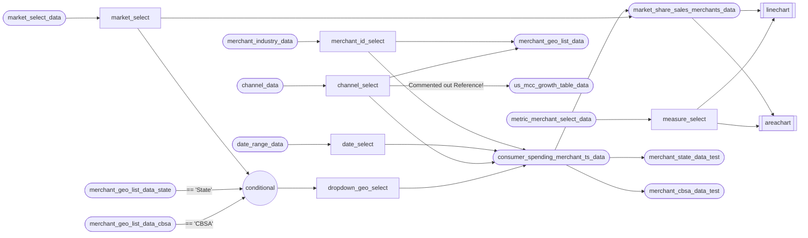

```sql categories
SELECT DISTINCT category from orders;
```

<Dropdown name="selected_category" data={categories} value=category defaultValue="Sinister Toys" />

```sql states
SELECT DISTINCT state FROM orders
WHERE category = '${inputs.selected_category.value}'
```

<Dropdown name="selected_state" data={states} value=state />

```sql local_orders
SELECT * FROM ORDERS

WHERE category = '${inputs.selected_category.value}'
  AND state = '${inputs.selected_state.value}'
```

<LineChart
  data={local_orders}
  x=order_month
  />

<!--
  Conditional
-->