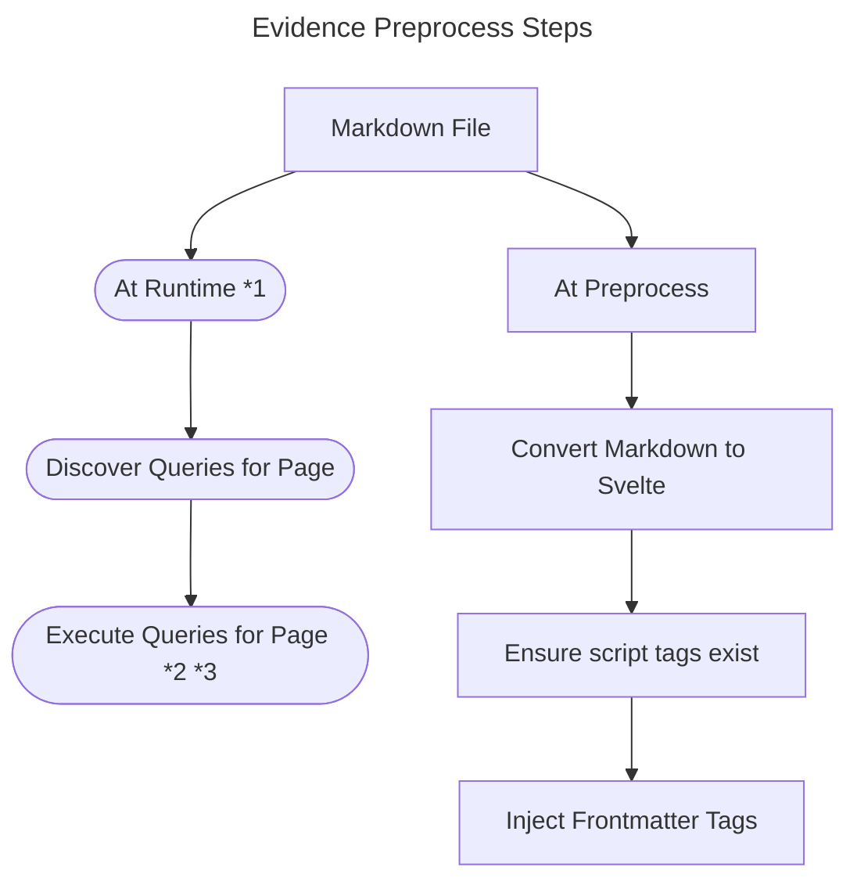

# Evidence Preprocess

This package is responsible for transforming Evidence Markdown files into Svelte Components / Pages.

## Overview

The basic pipeline looks something like this:

\*1 Evidence will render with the static adapter by default; which means that "runtime" becomes "buildtime".

\*2 This is handled by the [db-orchestrator package](../db-orchestrator/), not preprocess - but it is an important step.

\*3 This occurs in [`/pages/api/[route].json`](../../sites/example-project//src/pages/api/%5Broute%5D.json/%2Bserver.js). The Svelte Static Adapter pre-renders the result JSON files.
